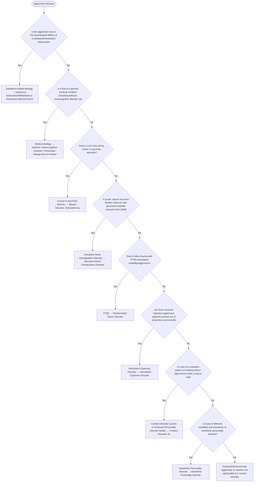

# 2.23 — Aggressive Behavior

**Presenting symptom:** Aggressive behavior

> Aggression is nonspecific. Rule out substance intoxication/withdrawal and medical causes (including delirium and neurocognitive disorders), then determine whether aggression is a feature of a mood, psychotic, developmental, trauma, or personality disorder, or a discrete impulse-control problem (intermittent explosive disorder, conduct disorder). Some aggression is purposeful and not a disorder.

## Decision flow

## Decision points

- **Is the aggression due to the physiological effects of a substance/medication (intoxication/withdrawal)?**
  - **Yes →** Substance-related etiology — _[Substance Intoxication/Withdrawal or Substance-Induced Disorder](excessive-substance-use.md)_
  - **No →** Is it due to a general medical condition (including delirium, neurocognitive disorder, personality change)?
- **Is it due to a general medical condition (including delirium, neurocognitive disorder, personality change)?**
  - **Yes →** Medical etiology — _[Delirium / Neurocognitive Disorder / Personality Change Due to Another Medical Condition](../tables/3-16-1.md)_
  - **No →** Does it occur only during manic or psychotic episodes?
- **Does it occur only during manic or psychotic episodes?**
  - **Yes →** A mood or psychotic disorder — _[Bipolar I Disorder](../tables/3-3-1.md); [Schizophrenia](../tables/3-2-1.md)_
  - **No →** In youth: severe recurrent temper outbursts with persistent irritability between them (DMDD)?
- **In youth: severe recurrent temper outbursts with persistent irritability between them (DMDD)?**
  - **Yes →** Disruptive Mood Dysregulation Disorder — _[Disruptive Mood Dysregulation Disorder](../tables/3-4-4.md)_
  - **No →** Does it follow trauma with PTSD-associated irritability/aggression?
- **Does it follow trauma with PTSD-associated irritability/aggression?**
  - **Yes →** PTSD — _[Posttraumatic Stress Disorder](../tables/3-7-1.md)_
  - **No →** Are there recurrent impulsive aggressive outbursts grossly out of proportion to provocation, not premeditated?
- **Are there recurrent impulsive aggressive outbursts grossly out of proportion to provocation, not premeditated?**
  - **Yes →** Intermittent Explosive Disorder — _[Intermittent Explosive Disorder](../tables/3-14-2.md)_
  - **No →** Is it part of a repetitive pattern of violating others' rights/norms (with a callous style)?
- **Is it part of a repetitive pattern of violating others' rights/norms (with a callous style)?**
  - **Yes →** Conduct Disorder (youth) or Antisocial Personality Disorder (adult) — _[Conduct Disorder](../tables/3-14-3.md); [Antisocial Personality Disorder](../tables/3-17-4.md)_
  - **No →** Is it part of affective instability and impulsivity of borderline personality disorder?
- **Is it part of affective instability and impulsivity of borderline personality disorder?**
  - **Yes →** Borderline Personality Disorder — _[Borderline Personality Disorder](../tables/3-17-5.md)_
  - **No →** Purposeful/instrumental aggression or reaction not attributable to a mental disorder

---
_Original synthesis of differentiating features only — no DSM criteria text reproduced. Confirm against the official DSM-5-TR criteria (e.g. "per DSM-5-TR criteria for …"). See [the six-step method](../framework.md). Decision support for clinician reference/research use — not a diagnostic substitute._
