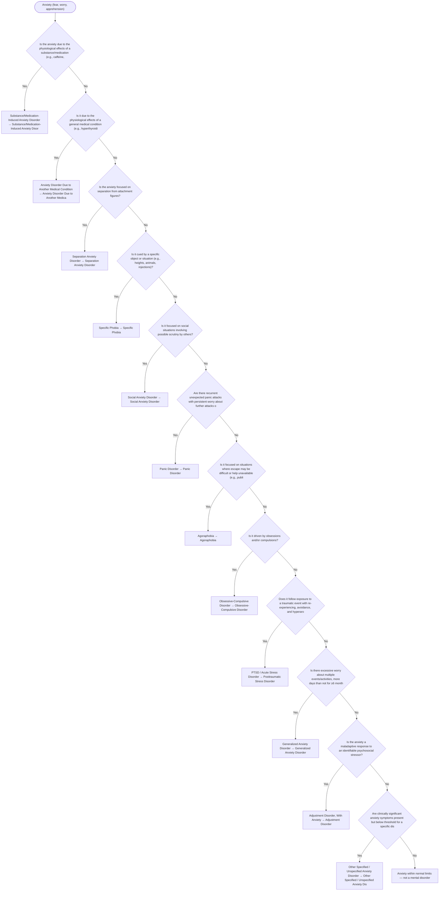

# 2.13 — Anxiety

**Presenting symptom:** Anxiety (fear, worry, apprehension)

> After ruling out substance and medical causes, the anxiety disorders are differentiated by the FOCUS of the fear/anxiety: separation from attachment figures, specific objects/situations, social scrutiny, unexpected panic and its consequences, or pervasive worry across domains. Obsessive-compulsive and trauma-related disorders are considered when the anxiety is tied to obsessions/compulsions or to a traumatic event.

## Decision flow

## Decision points

- **Is the anxiety due to the physiological effects of a substance/medication (e.g., caffeine, stimulants, withdrawal)?**
  - **Yes →** Substance/Medication-Induced Anxiety Disorder — _[Substance/Medication-Induced Anxiety Disorder](excessive-substance-use.md)_
  - **No →** Is it due to the physiological effects of a general medical condition (e.g., hyperthyroidism, arrhythmia)?
- **Is it due to the physiological effects of a general medical condition (e.g., hyperthyroidism, arrhythmia)?**
  - **Yes →** Anxiety Disorder Due to Another Medical Condition — _[Anxiety Disorder Due to Another Medical Condition](etiological-medical-conditions.md)_
  - **No →** Is the anxiety focused on separation from attachment figures?
- **Is the anxiety focused on separation from attachment figures?**
  - **Yes →** Separation Anxiety Disorder — _[Separation Anxiety Disorder](../tables/3-5-1.md)_
  - **No →** Is it cued by a specific object or situation (e.g., heights, animals, injections)?
- **Is it cued by a specific object or situation (e.g., heights, animals, injections)?**
  - **Yes →** Specific Phobia — _[Specific Phobia](../tables/3-5-3.md)_
  - **No →** Is it focused on social situations involving possible scrutiny by others?
- **Is it focused on social situations involving possible scrutiny by others?**
  - **Yes →** Social Anxiety Disorder — _[Social Anxiety Disorder](../tables/3-5-4.md)_
  - **No →** Are there recurrent unexpected panic attacks with persistent worry about further attacks or their consequences?
- **Are there recurrent unexpected panic attacks with persistent worry about further attacks or their consequences?**
  - **Yes →** Panic Disorder — _[Panic Disorder](../tables/3-5-5.md)_
  - **No →** Is it focused on situations where escape may be difficult or help unavailable (e.g., public transport, open/enclosed spaces, crowds)?
- **Is it focused on situations where escape may be difficult or help unavailable (e.g., public transport, open/enclosed spaces, crowds)?**
  - **Yes →** Agoraphobia — _[Agoraphobia](../tables/3-5-6.md)_
  - **No →** Is it driven by obsessions and/or compulsions?
- **Is it driven by obsessions and/or compulsions?**
  - **Yes →** Obsessive-Compulsive Disorder — _[Obsessive-Compulsive Disorder](../tables/3-6-1.md)_
  - **No →** Does it follow exposure to a traumatic event with re-experiencing, avoidance, and hyperarousal?
- **Does it follow exposure to a traumatic event with re-experiencing, avoidance, and hyperarousal?**
  - **Yes →** PTSD / Acute Stress Disorder — _[Posttraumatic Stress Disorder](../tables/3-7-1.md)_
  - **No →** Is there excessive worry about multiple events/activities, more days than not for ≥6 months, hard to control?
- **Is there excessive worry about multiple events/activities, more days than not for ≥6 months, hard to control?**
  - **Yes →** Generalized Anxiety Disorder — _[Generalized Anxiety Disorder](../tables/3-5-7.md)_
  - **No →** Is the anxiety a maladaptive response to an identifiable psychosocial stressor?
- **Is the anxiety a maladaptive response to an identifiable psychosocial stressor?**
  - **Yes →** Adjustment Disorder, With Anxiety — _[Adjustment Disorder](../tables/3-7-2.md)_
  - **No →** Are clinically significant anxiety symptoms present but below threshold for a specific disorder?
- **Are clinically significant anxiety symptoms present but below threshold for a specific disorder?**
  - **Yes →** Other Specified / Unspecified Anxiety Disorder — _[Other Specified / Unspecified Anxiety Disorder](../tables/3-5-7.md)_
  - **No →** Anxiety within normal limits — not a mental disorder

---
_Summarizes differentiating features only. Confirm against the full DSM-5 criteria. See [the six-step method](../framework.md)._
