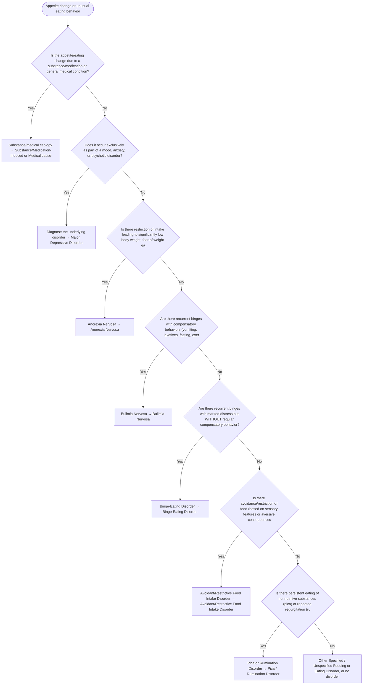

# 2.18 — Appetite Changes or Unusual Eating Behavior

**Presenting symptom:** Appetite change or unusual eating behavior

> Distinguish appetite/weight change occurring as part of another disorder (depression, mania, anxiety, psychosis) or a medical/substance cause from the primary feeding and eating disorders, which are differentiated by restriction and low weight (anorexia), binge-purge cycles (bulimia), binge eating without compensation (binge-eating disorder), avoidant/restrictive intake without body-image disturbance (ARFID), and eating of nonnutritive substances (pica) or regurgitation (rumination).

## Decision flow

## Decision points

- **Is the appetite/eating change due to a substance/medication or general medical condition?**
  - **Yes →** Substance/medical etiology — _[Substance/Medication-Induced or Medical cause](etiological-medical-conditions.md)_
  - **No →** Does it occur exclusively as part of a mood, anxiety, or psychotic disorder?
- **Does it occur exclusively as part of a mood, anxiety, or psychotic disorder?**
  - **Yes →** Diagnose the underlying disorder — _[Major Depressive Disorder](../tables/3-4-1.md)_
  - **No →** Is there restriction of intake leading to significantly low body weight, fear of weight gain, and body-image disturbance?
- **Is there restriction of intake leading to significantly low body weight, fear of weight gain, and body-image disturbance?**
  - **Yes →** Anorexia Nervosa — _[Anorexia Nervosa](../tables/3-10-2.md)_
  - **No →** Are there recurrent binges with compensatory behaviors (vomiting, laxatives, fasting, exercise), self-evaluation unduly influenced by shape/weight, at normal-ish weight?
- **Are there recurrent binges with compensatory behaviors (vomiting, laxatives, fasting, exercise), self-evaluation unduly influenced by shape/weight, at normal-ish weight?**
  - **Yes →** Bulimia Nervosa — _[Bulimia Nervosa](../tables/3-10-3.md)_
  - **No →** Are there recurrent binges with marked distress but WITHOUT regular compensatory behavior?
- **Are there recurrent binges with marked distress but WITHOUT regular compensatory behavior?**
  - **Yes →** Binge-Eating Disorder — _[Binge-Eating Disorder](../tables/3-10-4.md)_
  - **No →** Is there avoidance/restriction of food (based on sensory features or aversive consequences) with nutritional/psychosocial impact but no body-image disturbance?
- **Is there avoidance/restriction of food (based on sensory features or aversive consequences) with nutritional/psychosocial impact but no body-image disturbance?**
  - **Yes →** Avoidant/Restrictive Food Intake Disorder — _[Avoidant/Restrictive Food Intake Disorder](../tables/3-10-1.md)_
  - **No →** Is there persistent eating of nonnutritive substances (pica) or repeated regurgitation (rumination)?
- **Is there persistent eating of nonnutritive substances (pica) or repeated regurgitation (rumination)?**
  - **Yes →** Pica or Rumination Disorder — _[Pica / Rumination Disorder](../tables/3-10-1.md)_
  - **No →** Other Specified / Unspecified Feeding or Eating Disorder, or no disorder

---
_Summarizes differentiating features only. Confirm against the full DSM-5 criteria. See [the six-step method](../framework.md)._
