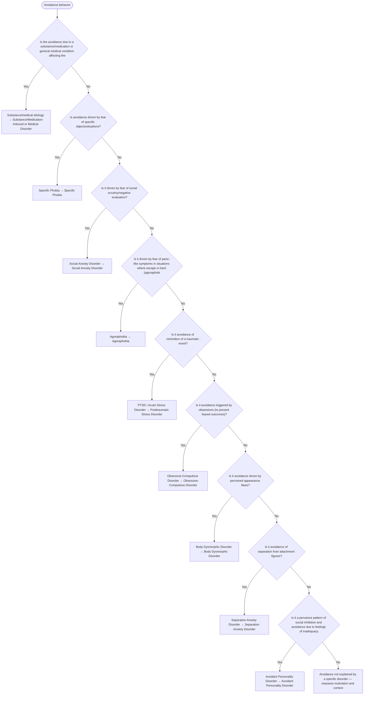

# 2.15 — Avoidance Behavior

**Presenting symptom:** Avoidance behavior

> Avoidance is a final common pathway of many disorders; the diagnostic question is WHAT is being avoided and WHY. Identify the motivation for avoidance — feared objects, social scrutiny, panic-prone situations, trauma reminders, obsessional triggers, appearance concerns, or separation — to reach the underlying disorder.

## Decision flow

## Decision points

- **Is the avoidance due to a substance/medication or general medical condition affecting the CNS?**
  - **Yes →** Substance/medical etiology — _[Substance/Medication-Induced or Medical Disorder](excessive-substance-use.md)_
  - **No →** Is avoidance driven by fear of specific objects/situations?
- **Is avoidance driven by fear of specific objects/situations?**
  - **Yes →** Specific Phobia — _[Specific Phobia](../tables/3-5-3.md)_
  - **No →** Is it driven by fear of social scrutiny/negative evaluation?
- **Is it driven by fear of social scrutiny/negative evaluation?**
  - **Yes →** Social Anxiety Disorder — _[Social Anxiety Disorder](../tables/3-5-4.md)_
  - **No →** Is it driven by fear of panic-like symptoms in situations where escape is hard (agoraphobia)?
- **Is it driven by fear of panic-like symptoms in situations where escape is hard (agoraphobia)?**
  - **Yes →** Agoraphobia — _[Agoraphobia](../tables/3-5-6.md)_
  - **No →** Is it avoidance of reminders of a traumatic event?
- **Is it avoidance of reminders of a traumatic event?**
  - **Yes →** PTSD / Acute Stress Disorder — _[Posttraumatic Stress Disorder](../tables/3-7-1.md)_
  - **No →** Is it avoidance triggered by obsessions (to prevent feared outcomes)?
- **Is it avoidance triggered by obsessions (to prevent feared outcomes)?**
  - **Yes →** Obsessive-Compulsive Disorder — _[Obsessive-Compulsive Disorder](../tables/3-6-1.md)_
  - **No →** Is it avoidance driven by perceived appearance flaws?
- **Is it avoidance driven by perceived appearance flaws?**
  - **Yes →** Body Dysmorphic Disorder — _[Body Dysmorphic Disorder](../tables/3-6-2.md)_
  - **No →** Is it avoidance of separation from attachment figures?
- **Is it avoidance of separation from attachment figures?**
  - **Yes →** Separation Anxiety Disorder — _[Separation Anxiety Disorder](../tables/3-5-1.md)_
  - **No →** Is it a pervasive pattern of social inhibition and avoidance due to feelings of inadequacy and fear of criticism (personality-level)?
- **Is it a pervasive pattern of social inhibition and avoidance due to feelings of inadequacy and fear of criticism (personality-level)?**
  - **Yes →** Avoidant Personality Disorder — _[Avoidant Personality Disorder](../tables/3-17-8.md)_
  - **No →** Avoidance not explained by a specific disorder — reassess motivation and context

---
_Original synthesis of differentiating features only — no DSM criteria text reproduced. Confirm against the official DSM-5-TR criteria (e.g. "per DSM-5-TR criteria for …"). See [the six-step method](../framework.md). Decision support for clinician reference/research use — not a diagnostic substitute._
