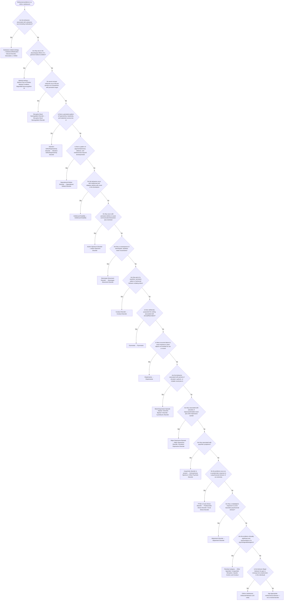

# 2.2 — Behavioral Problems in a Child or Adolescent

**Presenting symptom:** Behavioral problems in a child or adolescent

> Many behavioral problems in youth are not due to a mental disorder — some are subthreshold, some reflect family dysfunction, and some serious acts (e.g., for financial gain) fall outside DSM-5. Early-childhood onset points toward ADHD, ODD, DMDD, ASD, or intellectual disability; adolescent onset raises the role of substances and adolescent-onset conduct disorder, mood disorders, and psychosis.

## Decision flow

## Decision points

- **Are the behaviors associated with substance use (including medication)?**
  - **Yes →** Substance-related etiology — _[Substance/Medication-Induced Disorder, Intoxication, or Withdrawal](excessive-substance-use.md); [Substance Use Disorder](../tables/3-15-1.md)_
  - **No →** Are they due to the physiological effects of a general medical condition?
- **Are they due to the physiological effects of a general medical condition?**
  - **Yes →** Medical etiology — _[Delirium Due to Another Medical Condition](../tables/3-16-1.md); [Major/Mild Neurocognitive Disorder, with Behavioral Disturbance](../tables/3-16-2.md); [Personality Change Due to Another Medical Condition](../tables/3-17-11.md)_
  - **No →** Do severe temper outbursts occur that are grossly out of proportion, with persistent anger/irritability between them?
- **Do severe temper outbursts occur that are grossly out of proportion, with persistent anger/irritability between them?**
  - **Yes →** Disruptive Mood Dysregulation Disorder — _[Disruptive Mood Dysregulation Disorder](../tables/3-4-4.md)_
  - **No →** Is there a persistent pattern of hyperactivity, impulsivity, and inattention across two or more settings with onset before age 12?
- **Is there a persistent pattern of hyperactivity, impulsivity, and inattention across two or more settings with onset before age 12?**
  - **Yes →** Attention-Deficit/Hyperactivity Disorder — _[Attention-Deficit/Hyperactivity Disorder](../tables/3-1-4.md)_
  - **No →** Is there a pattern of argumentativeness, defiance, and vindictiveness beyond developmental norms?
- **Is there a pattern of argumentativeness, defiance, and vindictiveness beyond developmental norms?**
  - **Yes →** Oppositional Defiant Disorder — _[Oppositional Defiant Disorder](../tables/3-14-1.md)_
  - **No →** Do the behaviors occur with intellectual and adaptive deficits with onset in the developmental period?
- **Do the behaviors occur with intellectual and adaptive deficits with onset in the developmental period?**
  - **Yes →** Intellectual Disability — _[Intellectual Disability](../tables/3-1-1.md)_
  - **No →** Do they occur with persistent deficits in social communication/interaction plus restricted, repetitive behaviors?
- **Do they occur with persistent deficits in social communication/interaction plus restricted, repetitive behaviors?**
  - **Yes →** Autism Spectrum Disorder — _[Autism Spectrum Disorder](../tables/3-1-3.md)_
  - **No →** Are they a consequence of stereotyped, repetitive motor movements?
- **Are they a consequence of stereotyped, repetitive motor movements?**
  - **Yes →** Stereotypic Movement Disorder — _Stereotypic Movement Disorder_
  - **No →** Are they part of a repetitive, persistent pattern of antisocial behavior violating others' rights or major norms?
- **Are they part of a repetitive, persistent pattern of antisocial behavior violating others' rights or major norms?**
  - **Yes →** Conduct Disorder — _[Conduct Disorder](../tables/3-14-3.md)_
  - **No →** Is there deliberate, purposeful fire setting associated with arousal/fascination?
- **Is there deliberate, purposeful fire setting associated with arousal/fascination?**
  - **Yes →** Pyromania — _Pyromania_
  - **No →** Is there recurrent failure to resist impulses to steal objects not needed for use or monetary value?
- **Is there recurrent failure to resist impulses to steal objects not needed for use or monetary value?**
  - **Yes →** Kleptomania — _Kleptomania_
  - **No →** Are the behaviors associated with periods of elevated, euphoric, or irritable mood plus increased energy?
- **Are the behaviors associated with periods of elevated, euphoric, or irritable mood plus increased energy?**
  - **Yes →** Manic/Hypomanic Episode — _[Bipolar I Disorder](../tables/3-3-1.md); [Bipolar II Disorder](../tables/3-3-2.md); [Cyclothymic Disorder](../tables/3-3-3.md)_
  - **No →** Are they associated with episodes of depressed/irritable mood plus other depressive symptoms?
- **Are they associated with episodes of depressed/irritable mood plus other depressive symptoms?**
  - **Yes →** Major Depressive Episode — _[Major Depressive Disorder](../tables/3-4-1.md); [Persistent Depressive Disorder](../tables/3-4-2.md)_
  - **No →** Are they associated with psychotic symptoms?
- **Are they associated with psychotic symptoms?**
  - **Yes →** A psychotic disorder is present — _[Schizophrenia Spectrum / Other Psychotic Disorder](../tables/3-2-1.md)_
  - **No →** Do the problems occur as a symptomatic response to a psychosocial stressor of an extremely traumatic nature, with re-experiencing?
- **Do the problems occur as a symptomatic response to a psychosocial stressor of an extremely traumatic nature, with re-experiencing?**
  - **Yes →** PTSD or Acute Stress Disorder — _[Posttraumatic Stress Disorder / Acute Stress Disorder](../tables/3-7-1.md)_
  - **No →** Are they a maladaptive response to a (non-traumatic) psychosocial stressor?
- **Are they a maladaptive response to a (non-traumatic) psychosocial stressor?**
  - **Yes →** Adjustment Disorder — _[Adjustment Disorder](../tables/3-7-2.md)_
  - **No →** Are the problems clinically significant and representative of a psychological/biological dysfunction, but not covered above?
- **Are the problems clinically significant and representative of a psychological/biological dysfunction, but not covered above?**
  - **Yes →** Residual category — _Other Specified / Unspecified Disruptive, Impulse-Control, and Conduct Disorder_
  - **No →** Is the behavior illegal behavior for gain or revenge (not a dysfunction in the individual)?
- **Is the behavior illegal behavior for gain or revenge (not a dysfunction in the individual)?**
  - **Yes →** Child or Adolescent Antisocial Behavior (V/Z code)
  - **No →** Age-appropriate rambunctious behavior — not a mental disorder

---
_Original synthesis of differentiating features only — no DSM criteria text reproduced. Confirm against the official DSM-5-TR criteria (e.g. "per DSM-5-TR criteria for …"). See [the six-step method](../framework.md). Decision support for clinician reference/research use — not a diagnostic substitute._
