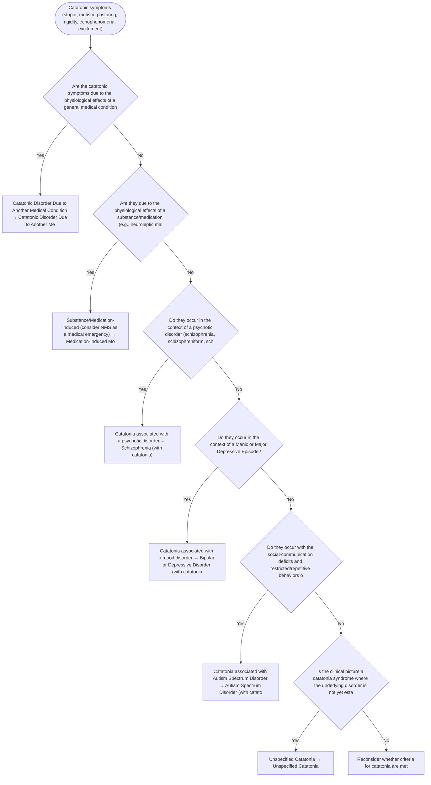

# 2.7 — Catatonic Symptoms

**Presenting symptom:** Catatonic symptoms (stupor, mutism, posturing, rigidity, echophenomena, excitement)

> Catatonia is a syndrome, not a diagnosis. It occurs with medical conditions, psychotic disorders, and mood disorders, and it can be life-threatening (malignant catatonia). Identify the underlying context; DSM-5 codes catatonia as a specifier of another mental disorder, catatonia due to another medical condition, or unspecified catatonia.

## Decision flow

## Decision points

- **Are the catatonic symptoms due to the physiological effects of a general medical condition?**
  - **Yes →** Catatonic Disorder Due to Another Medical Condition — _[Catatonic Disorder Due to Another Medical Condition](etiological-medical-conditions.md)_
  - **No →** Are they due to the physiological effects of a substance/medication (e.g., neuroleptic malignant syndrome, intoxication)?
- **Are they due to the physiological effects of a substance/medication (e.g., neuroleptic malignant syndrome, intoxication)?**
  - **Yes →** Substance/Medication-Induced (consider NMS as a medical emergency) — _[Medication-Induced Movement Disorder / Substance-Induced state](excessive-substance-use.md)_
  - **No →** Do they occur in the context of a psychotic disorder (schizophrenia, schizophreniform, schizoaffective, brief psychotic)?
- **Do they occur in the context of a psychotic disorder (schizophrenia, schizophreniform, schizoaffective, brief psychotic)?**
  - **Yes →** Catatonia associated with a psychotic disorder — _[Schizophrenia (with catatonia)](../tables/3-2-1.md)_
  - **No →** Do they occur in the context of a Manic or Major Depressive Episode?
- **Do they occur in the context of a Manic or Major Depressive Episode?**
  - **Yes →** Catatonia associated with a mood disorder — _[Bipolar or Depressive Disorder (with catatonia)](../tables/3-3-1.md)_
  - **No →** Do they occur with the social-communication deficits and restricted/repetitive behaviors of autism spectrum disorder?
- **Do they occur with the social-communication deficits and restricted/repetitive behaviors of autism spectrum disorder?**
  - **Yes →** Catatonia associated with Autism Spectrum Disorder — _[Autism Spectrum Disorder (with catatonia)](../tables/3-1-3.md)_
  - **No →** Is the clinical picture a catatonia syndrome where the underlying disorder is not yet established?
- **Is the clinical picture a catatonia syndrome where the underlying disorder is not yet established?**
  - **Yes →** Unspecified Catatonia — _[Unspecified Catatonia](../tables/3-2-5.md)_
  - **No →** Reconsider whether criteria for catatonia are met

---
_Original synthesis of differentiating features only — no DSM criteria text reproduced. Confirm against the official DSM-5-TR criteria (e.g. "per DSM-5-TR criteria for …"). See [the six-step method](../framework.md). Decision support for clinician reference/research use — not a diagnostic substitute._
