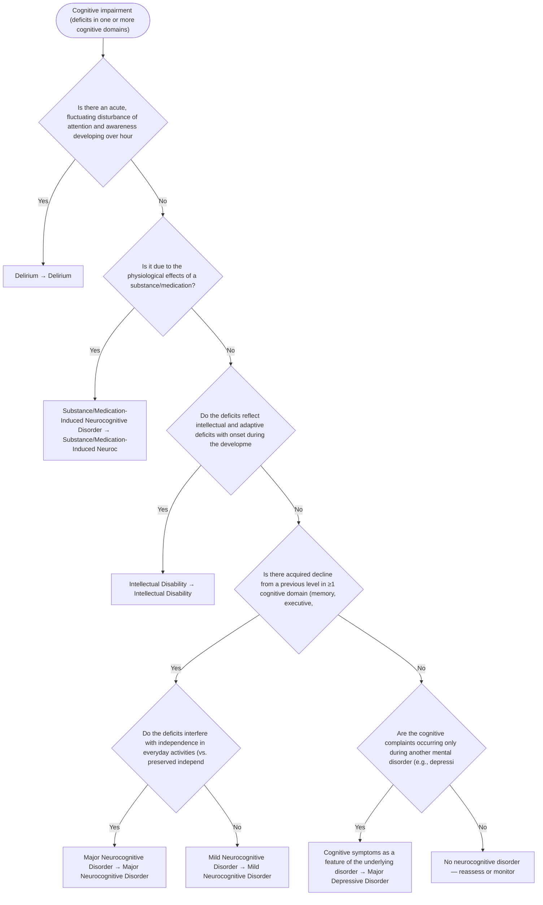

# 2.28 — Cognitive Impairment

**Presenting symptom:** Cognitive impairment (deficits in one or more cognitive domains)

> Broad cognitive impairment requires separating delirium (acute, fluctuating, with attentional disturbance) from the neurocognitive disorders (acquired decline from a prior level), intellectual disability (onset in the developmental period), and cognitive complaints that are features of other mental disorders (e.g., pseudodementia of depression). Establish onset, course, and whether consciousness is clear.

## Decision flow

## Decision points

- **Is there an acute, fluctuating disturbance of attention and awareness developing over hours to days (delirium)?**
  - **Yes →** Delirium — _[Delirium](../tables/3-16-1.md)_
  - **No →** Is it due to the physiological effects of a substance/medication?
- **Is it due to the physiological effects of a substance/medication?**
  - **Yes →** Substance/Medication-Induced Neurocognitive Disorder — _[Substance/Medication-Induced Neurocognitive Disorder](excessive-substance-use.md)_
  - **No →** Do the deficits reflect intellectual and adaptive deficits with onset during the developmental period (not a decline)?
- **Do the deficits reflect intellectual and adaptive deficits with onset during the developmental period (not a decline)?**
  - **Yes →** Intellectual Disability — _[Intellectual Disability](../tables/3-1-1.md)_
  - **No →** Is there acquired decline from a previous level in ≥1 cognitive domain (memory, executive, attention, language, perceptual-motor, social cognition)?
- **Is there acquired decline from a previous level in ≥1 cognitive domain (memory, executive, attention, language, perceptual-motor, social cognition)?**
  - **Yes →** Do the deficits interfere with independence in everyday activities (vs. preserved independence with greater effort)?
  - **No →** Are the cognitive complaints occurring only during another mental disorder (e.g., depression, psychosis)?
- **Do the deficits interfere with independence in everyday activities (vs. preserved independence with greater effort)?**
  - **Yes →** Major Neurocognitive Disorder — _[Major Neurocognitive Disorder](../tables/3-16-2.md)_
  - **No →** Mild Neurocognitive Disorder — _[Mild Neurocognitive Disorder](../tables/3-16-2.md)_
- **Are the cognitive complaints occurring only during another mental disorder (e.g., depression, psychosis)?**
  - **Yes →** Cognitive symptoms as a feature of the underlying disorder — _[Major Depressive Disorder](../tables/3-4-1.md)_
  - **No →** No neurocognitive disorder — reassess or monitor

---
_Summarizes differentiating features only. Confirm against the full DSM-5 criteria. See [the six-step method](../framework.md)._
