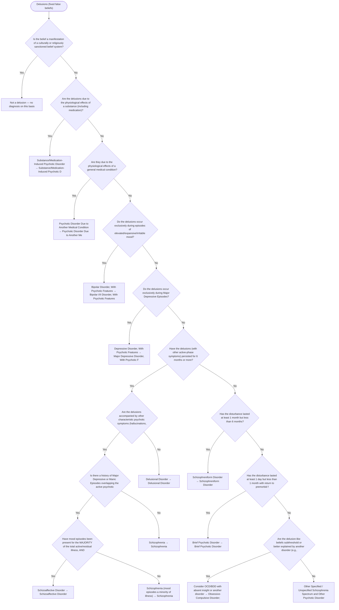

# 2.5 — Delusions

**Presenting symptom:** Delusions (fixed false beliefs)

> First confirm the belief is a true delusion and not a culturally or religiously sanctioned belief. Then apply the etiologic rule-outs (substance, medical) before differentiating among the primary psychotic and mood disorders. The mood/psychosis relationship — whether delusions are confined to mood episodes, and the proportion of the illness occupied by mood episodes — drives the schizophrenia vs. schizoaffective vs. mood-disorder-with-psychotic-features distinctions.

## Decision flow

## Decision points

- **Is the belief a manifestation of a culturally or religiously sanctioned belief system?**
  - **Yes →** Not a delusion — no diagnosis on this basis
  - **No →** Are the delusions due to the physiological effects of a substance (including medication)?
- **Are the delusions due to the physiological effects of a substance (including medication)?**
  - **Yes →** Substance/Medication-Induced Psychotic Disorder — _[Substance/Medication-Induced Psychotic Disorder](excessive-substance-use.md)_
  - **No →** Are they due to the physiological effects of a general medical condition?
- **Are they due to the physiological effects of a general medical condition?**
  - **Yes →** Psychotic Disorder Due to Another Medical Condition — _[Psychotic Disorder Due to Another Medical Condition](etiological-medical-conditions.md)_
  - **No →** Do the delusions occur exclusively during episodes of elevated/expansive/irritable mood?
- **Do the delusions occur exclusively during episodes of elevated/expansive/irritable mood?**
  - **Yes →** Bipolar Disorder, With Psychotic Features — _[Bipolar I/II Disorder, With Psychotic Features](../tables/3-3-1.md)_
  - **No →** Do the delusions occur exclusively during Major Depressive Episodes?
- **Do the delusions occur exclusively during Major Depressive Episodes?**
  - **Yes →** Depressive Disorder, With Psychotic Features — _[Major Depressive Disorder, With Psychotic Features](../tables/3-4-1.md)_
  - **No →** Have the delusions (with other active-phase symptoms) persisted for 6 months or more?
- **Have the delusions (with other active-phase symptoms) persisted for 6 months or more?**
  - _Duration and the mood relationship separate schizophrenia, schizophreniform, schizoaffective, brief psychotic, and delusional disorder._
  - **Yes →** Are the delusions accompanied by other characteristic psychotic symptoms (hallucinations, disorganized speech, grossly disorganized/catatonic behavior, or negative symptoms)?
  - **No →** Has the disturbance lasted at least 1 month but less than 6 months?
- **Are the delusions accompanied by other characteristic psychotic symptoms (hallucinations, disorganized speech, grossly disorganized/catatonic behavior, or negative symptoms)?**
  - **Yes →** Is there a history of Major Depressive or Manic Episodes overlapping the active psychotic period?
  - **No →** Delusional Disorder — _[Delusional Disorder](../tables/3-2-3.md)_
- **Is there a history of Major Depressive or Manic Episodes overlapping the active psychotic period?**
  - **Yes →** Have mood episodes been present for the MAJORITY of the total active/residual illness, AND were there ≥2 weeks of delusions/hallucinations without a mood episode?
  - **No →** Schizophrenia — _[Schizophrenia](../tables/3-2-1.md)_
- **Have mood episodes been present for the MAJORITY of the total active/residual illness, AND were there ≥2 weeks of delusions/hallucinations without a mood episode?**
  - _Schizoaffective requires a concurrent mood episode for the majority of the illness plus ≥2 weeks of psychosis without prominent mood symptoms. If mood episodes occupy only a minority, favor Schizophrenia; if psychosis is confined to mood episodes, favor a mood disorder with psychotic features._
  - **Yes →** Schizoaffective Disorder — _[Schizoaffective Disorder](../tables/3-2-2.md)_
  - **No →** Schizophrenia (mood episodes a minority of illness) — _[Schizophrenia](../tables/3-2-1.md)_
- **Has the disturbance lasted at least 1 month but less than 6 months?**
  - **Yes →** Schizophreniform Disorder — _[Schizophreniform Disorder](../tables/3-2-1.md)_
  - **No →** Has the disturbance lasted at least 1 day but less than 1 month with return to premorbid functioning?
- **Has the disturbance lasted at least 1 day but less than 1 month with return to premorbid functioning?**
  - **Yes →** Brief Psychotic Disorder — _[Brief Psychotic Disorder](../tables/3-2-4.md)_
  - **No →** Are the delusion-like beliefs subthreshold or better explained by another disorder (e.g., OCD, body dysmorphic disorder, delusional-level)?
- **Are the delusion-like beliefs subthreshold or better explained by another disorder (e.g., OCD, body dysmorphic disorder, delusional-level)?**
  - **Yes →** Consider OCD/BDD with absent insight or another disorder — _[Obsessive-Compulsive Disorder](../tables/3-6-1.md); [Body Dysmorphic Disorder](../tables/3-6-2.md)_
  - **No →** Other Specified / Unspecified Schizophrenia Spectrum and Other Psychotic Disorder

---
_Summarizes differentiating features only. Confirm against the full DSM-5 criteria. See [the six-step method](../framework.md)._
