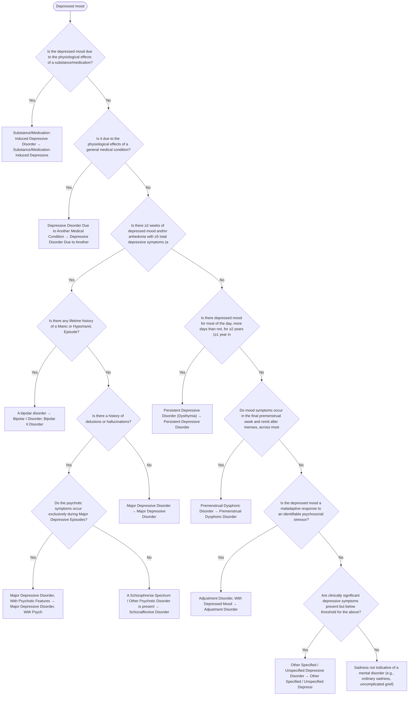

# 2.10 — Depressed Mood

**Presenting symptom:** Depressed mood

> One of the most common presentations. After ruling out substance and medical etiologies, determine whether the depressed mood constitutes a Major Depressive Episode, then whether there is any history of mania/hypomania (which reclassifies the case as bipolar), and how psychotic symptoms relate to the mood episodes. Subthreshold, persistent, and stressor-related presentations are captured at the end.

## Decision flow

## Decision points

- **Is the depressed mood due to the physiological effects of a substance/medication?**
  - **Yes →** Substance/Medication-Induced Depressive Disorder — _[Substance/Medication-Induced Depressive Disorder](excessive-substance-use.md)_
  - **No →** Is it due to the physiological effects of a general medical condition?
- **Is it due to the physiological effects of a general medical condition?**
  - **Yes →** Depressive Disorder Due to Another Medical Condition — _[Depressive Disorder Due to Another Medical Condition](etiological-medical-conditions.md)_
  - **No →** Is there ≥2 weeks of depressed mood and/or anhedonia with ≥5 total depressive symptoms (a Major Depressive Episode)?
- **Is there ≥2 weeks of depressed mood and/or anhedonia with ≥5 total depressive symptoms (a Major Depressive Episode)?**
  - **Yes →** Is there any lifetime history of a Manic or Hypomanic Episode?
  - **No →** Is there depressed mood for most of the day, more days than not, for ≥2 years (≥1 year in children/adolescents)?
- **Is there any lifetime history of a Manic or Hypomanic Episode?**
  - _A single lifetime manic/hypomanic episode reclassifies the case as bipolar._
  - **Yes →** A bipolar disorder — _[Bipolar I Disorder](../tables/3-3-1.md); [Bipolar II Disorder](../tables/3-3-2.md)_
  - **No →** Is there a history of delusions or hallucinations?
- **Is there a history of delusions or hallucinations?**
  - **Yes →** Do the psychotic symptoms occur exclusively during Major Depressive Episodes?
  - **No →** Major Depressive Disorder — _[Major Depressive Disorder](../tables/3-4-1.md)_
- **Do the psychotic symptoms occur exclusively during Major Depressive Episodes?**
  - **Yes →** Major Depressive Disorder, With Psychotic Features — _[Major Depressive Disorder, With Psychotic Features](../tables/3-4-1.md)_
  - **No →** A Schizophrenia Spectrum / Other Psychotic Disorder is present — _[Schizoaffective Disorder](../tables/3-2-2.md)_
- **Is there depressed mood for most of the day, more days than not, for ≥2 years (≥1 year in children/adolescents)?**
  - **Yes →** Persistent Depressive Disorder (Dysthymia) — _[Persistent Depressive Disorder](../tables/3-4-2.md)_
  - **No →** Do mood symptoms occur in the final premenstrual week and remit after menses, across most cycles?
- **Do mood symptoms occur in the final premenstrual week and remit after menses, across most cycles?**
  - **Yes →** Premenstrual Dysphoric Disorder — _[Premenstrual Dysphoric Disorder](../tables/3-4-3.md)_
  - **No →** Is the depressed mood a maladaptive response to an identifiable psychosocial stressor?
- **Is the depressed mood a maladaptive response to an identifiable psychosocial stressor?**
  - **Yes →** Adjustment Disorder, With Depressed Mood — _[Adjustment Disorder](../tables/3-7-2.md)_
  - **No →** Are clinically significant depressive symptoms present but below threshold for the above?
- **Are clinically significant depressive symptoms present but below threshold for the above?**
  - **Yes →** Other Specified / Unspecified Depressive Disorder — _[Other Specified / Unspecified Depressive Disorder](../tables/3-4-1.md)_
  - **No →** Sadness not indicative of a mental disorder (e.g., ordinary sadness, uncomplicated grief)

---
_Original synthesis of differentiating features only — no DSM criteria text reproduced. Confirm against the official DSM-5-TR criteria (e.g. "per DSM-5-TR criteria for …"). See [the six-step method](../framework.md). Decision support for clinician reference/research use — not a diagnostic substitute._
