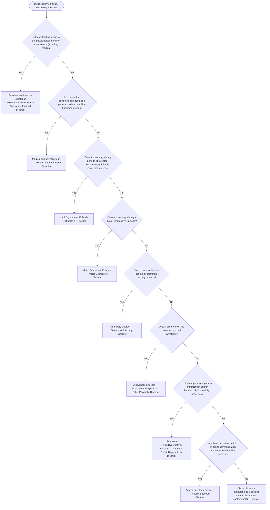

# 2.4 — Distractibility

**Presenting symptom:** Distractibility / difficulty sustaining attention

> Reduced ability to sustain attention is nonspecific and occurs across many disorders. Rule out substances and medical causes, then distinguish attentional problems that are episodic and mood-linked (mania, depression, anxiety, psychosis) from the persistent, cross-situational, early-onset pattern of ADHD.

## Decision flow

## Decision points

- **Is the distractibility due to the physiological effects of a substance (including medication)?**
  - **Yes →** Substance-induced — _[Substance Intoxication/Withdrawal or Substance-Induced Disorder](excessive-substance-use.md)_
  - **No →** Is it due to the physiological effects of a general medical condition (including delirium)?
- **Is it due to the physiological effects of a general medical condition (including delirium)?**
  - **Yes →** Medical etiology / Delirium — _[Delirium](../tables/3-16-1.md); [Neurocognitive Disorder](../tables/3-16-2.md)_
  - **No →** Does it occur only during periods of elevated, expansive, or irritable mood with increased energy?
- **Does it occur only during periods of elevated, expansive, or irritable mood with increased energy?**
  - **Yes →** Manic/Hypomanic Episode — _[Bipolar I/II Disorder](../tables/3-3-1.md)_
  - **No →** Does it occur only during a Major Depressive Episode?
- **Does it occur only during a Major Depressive Episode?**
  - **Yes →** Major Depressive Episode — _[Major Depressive Disorder](../tables/3-4-1.md)_
  - **No →** Does it occur only in the context of prominent anxiety or worry?
- **Does it occur only in the context of prominent anxiety or worry?**
  - **Yes →** An anxiety disorder — _[Generalized Anxiety Disorder](../tables/3-5-7.md)_
  - **No →** Does it occur only in the context of psychotic symptoms?
- **Does it occur only in the context of psychotic symptoms?**
  - **Yes →** A psychotic disorder — _[Schizophrenia Spectrum / Other Psychotic Disorder](../tables/3-2-1.md)_
  - **No →** Is there a persistent pattern of inattention and/or hyperactivity-impulsivity, onset before age 12, impairing across settings?
- **Is there a persistent pattern of inattention and/or hyperactivity-impulsivity, onset before age 12, impairing across settings?**
  - **Yes →** Attention-Deficit/Hyperactivity Disorder — _[Attention-Deficit/Hyperactivity Disorder](../tables/3-1-4.md)_
  - **No →** Are there persistent deficits in social communication and restricted/repetitive behaviors (ASD)?
- **Are there persistent deficits in social communication and restricted/repetitive behaviors (ASD)?**
  - **Yes →** Autism Spectrum Disorder — _[Autism Spectrum Disorder](../tables/3-1-3.md)_
  - **No →** Distractibility not attributable to a specific mental disorder (or subthreshold) — consider context

---
_Original synthesis of differentiating features only — no DSM criteria text reproduced. Confirm against the official DSM-5-TR criteria (e.g. "per DSM-5-TR criteria for …"). See [the six-step method](../framework.md). Decision support for clinician reference/research use — not a diagnostic substitute._
