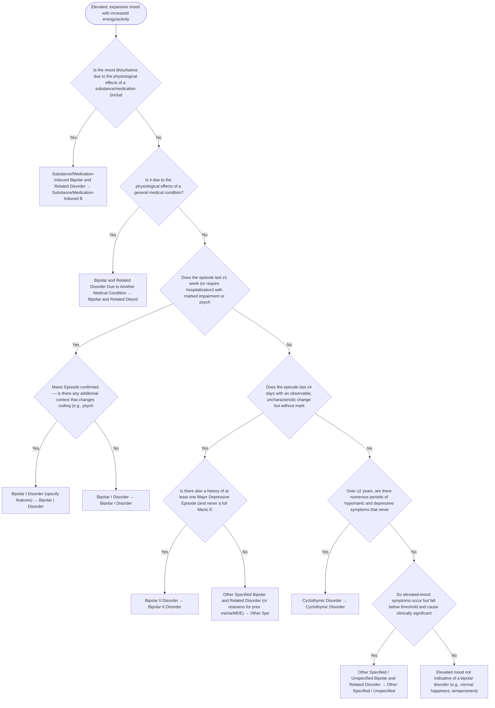

# 2.8 — Elevated or Expansive Mood

**Presenting symptom:** Elevated, expansive mood with increased energy/activity

> Establish whether the mood episode is a full Manic Episode (≥1 week or hospitalization, marked impairment/psychosis) or a Hypomanic Episode (≥4 days, observable but not markedly impairing, no psychosis). Manic and hypomanic episodes are the building blocks for the bipolar disorders. Always rule out substance/medication and medical causes first.

## Decision flow

## Decision points

- **Is the mood disturbance due to the physiological effects of a substance/medication (including antidepressant-triggered switch persisting beyond physiological effect)?**
  - **Yes →** Substance/Medication-Induced Bipolar and Related Disorder — _[Substance/Medication-Induced Bipolar and Related Disorder](excessive-substance-use.md)_
  - **No →** Is it due to the physiological effects of a general medical condition?
- **Is it due to the physiological effects of a general medical condition?**
  - **Yes →** Bipolar and Related Disorder Due to Another Medical Condition — _[Bipolar and Related Disorder Due to Another Medical Condition](etiological-medical-conditions.md)_
  - **No →** Does the episode last ≥1 week (or require hospitalization) with marked impairment or psychotic features?
- **Does the episode last ≥1 week (or require hospitalization) with marked impairment or psychotic features?**
  - _This defines a Manic Episode._
  - **Yes →** Manic Episode confirmed — is there any additional context that changes coding (e.g., psychotic features, mixed features)?
  - **No →** Does the episode last ≥4 days with an observable, uncharacteristic change but without marked impairment or psychosis (Hypomanic Episode)?
- **Manic Episode confirmed — is there any additional context that changes coding (e.g., psychotic features, mixed features)?**
  - **Yes →** Bipolar I Disorder (specify features) — _[Bipolar I Disorder](../tables/3-3-1.md)_
  - **No →** Bipolar I Disorder — _[Bipolar I Disorder](../tables/3-3-1.md)_
- **Does the episode last ≥4 days with an observable, uncharacteristic change but without marked impairment or psychosis (Hypomanic Episode)?**
  - **Yes →** Is there also a history of at least one Major Depressive Episode (and never a full Manic Episode)?
  - **No →** Over ≥2 years, are there numerous periods of hypomanic and depressive symptoms that never meet full episode criteria?
- **Is there also a history of at least one Major Depressive Episode (and never a full Manic Episode)?**
  - **Yes →** Bipolar II Disorder — _[Bipolar II Disorder](../tables/3-3-2.md)_
  - **No →** Other Specified Bipolar and Related Disorder (or reassess for prior mania/MDE) — _[Other Specified Bipolar and Related Disorder](../tables/3-3-2.md)_
- **Over ≥2 years, are there numerous periods of hypomanic and depressive symptoms that never meet full episode criteria?**
  - **Yes →** Cyclothymic Disorder — _[Cyclothymic Disorder](../tables/3-3-3.md)_
  - **No →** Do elevated-mood symptoms occur but fall below threshold and cause clinically significant distress/impairment?
- **Do elevated-mood symptoms occur but fall below threshold and cause clinically significant distress/impairment?**
  - **Yes →** Other Specified / Unspecified Bipolar and Related Disorder — _[Other Specified / Unspecified Bipolar and Related Disorder](../tables/3-3-1.md)_
  - **No →** Elevated mood not indicative of a bipolar disorder (e.g., normal happiness, temperament)

---
_Summarizes differentiating features only. Confirm against the full DSM-5 criteria. See [the six-step method](../framework.md)._
