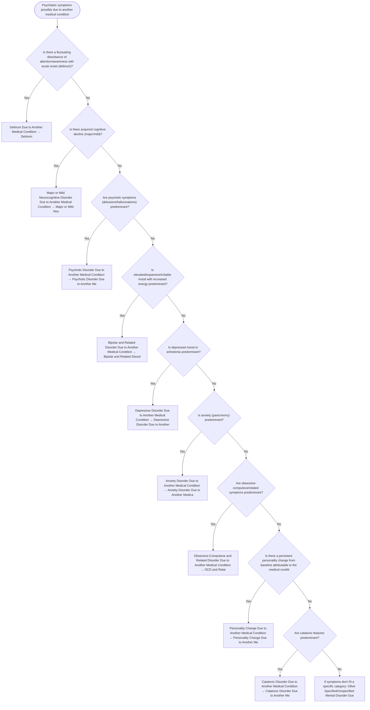

# 2.29 — Etiological Medical Conditions

**Presenting symptom:** Psychiatric symptoms possibly due to another medical condition

> When a general medical condition is judged to physiologically cause the psychiatric symptoms, DSM-5 provides a family of 'Due to Another Medical Condition' diagnoses selected by the predominant symptom. This tree routes an established medical etiology to the correct disorder by presenting symptom.

## Decision flow

## Decision points

- **Is there a fluctuating disturbance of attention/awareness with acute onset (delirium)?**
  - **Yes →** Delirium Due to Another Medical Condition — _[Delirium](../tables/3-16-1.md)_
  - **No →** Is there acquired cognitive decline (major/mild)?
- **Is there acquired cognitive decline (major/mild)?**
  - **Yes →** Major or Mild Neurocognitive Disorder Due to Another Medical Condition — _[Major or Mild Neurocognitive Disorder](../tables/3-16-2.md)_
  - **No →** Are psychotic symptoms (delusions/hallucinations) predominant?
- **Are psychotic symptoms (delusions/hallucinations) predominant?**
  - **Yes →** Psychotic Disorder Due to Another Medical Condition — _Psychotic Disorder Due to Another Medical Condition_
  - **No →** Is elevated/expansive/irritable mood with increased energy predominant?
- **Is elevated/expansive/irritable mood with increased energy predominant?**
  - **Yes →** Bipolar and Related Disorder Due to Another Medical Condition — _Bipolar and Related Disorder Due to Another Medical Condition_
  - **No →** Is depressed mood or anhedonia predominant?
- **Is depressed mood or anhedonia predominant?**
  - **Yes →** Depressive Disorder Due to Another Medical Condition — _Depressive Disorder Due to Another Medical Condition_
  - **No →** Is anxiety (panic/worry) predominant?
- **Is anxiety (panic/worry) predominant?**
  - **Yes →** Anxiety Disorder Due to Another Medical Condition — _Anxiety Disorder Due to Another Medical Condition_
  - **No →** Are obsessive-compulsive/related symptoms predominant?
- **Are obsessive-compulsive/related symptoms predominant?**
  - **Yes →** Obsessive-Compulsive and Related Disorder Due to Another Medical Condition — _OCD and Related Disorder Due to Another Medical Condition_
  - **No →** Is there a persistent personality change from baseline attributable to the medical condition?
- **Is there a persistent personality change from baseline attributable to the medical condition?**
  - **Yes →** Personality Change Due to Another Medical Condition — _[Personality Change Due to Another Medical Condition](../tables/3-17-11.md)_
  - **No →** Are catatonic features predominant?
- **Are catatonic features predominant?**
  - **Yes →** Catatonic Disorder Due to Another Medical Condition — _[Catatonic Disorder Due to Another Medical Condition](../tables/3-2-5.md)_
  - **No →** If symptoms don't fit a specific category: Other Specified/Unspecified Mental Disorder Due to Another Medical Condition

---
_Original synthesis of differentiating features only — no DSM criteria text reproduced. Confirm against the official DSM-5-TR criteria (e.g. "per DSM-5-TR criteria for …"). See [the six-step method](../framework.md). Decision support for clinician reference/research use — not a diagnostic substitute._
