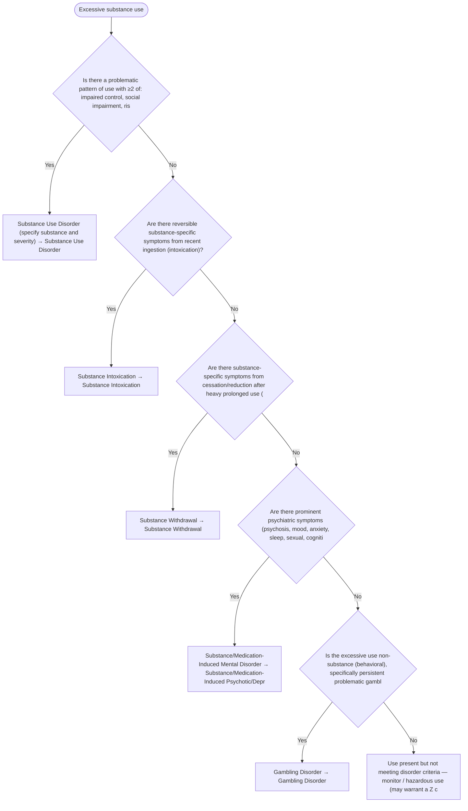

# 2.26 — Excessive Substance Use

**Presenting symptom:** Excessive substance use

> Two questions run in parallel: is there a substance use disorder (a maladaptive pattern with impaired control, social impairment, risky use, and pharmacological features), and are there substance-induced mental disorders (intoxication, withdrawal, or a substance-induced disorder such as psychotic, mood, or anxiety disorder)? This tree also anchors the substance-etiology decisions used throughout the other trees.

## Decision flow

## Decision points

- **Is there a problematic pattern of use with ≥2 of: impaired control, social impairment, risky use, tolerance/withdrawal, within 12 months?**
  - **Yes →** Substance Use Disorder (specify substance and severity) — _[Substance Use Disorder](../tables/3-15-1.md)_
  - **No →** Are there reversible substance-specific symptoms from recent ingestion (intoxication)?
- **Are there reversible substance-specific symptoms from recent ingestion (intoxication)?**
  - **Yes →** Substance Intoxication — _Substance Intoxication_
  - **No →** Are there substance-specific symptoms from cessation/reduction after heavy prolonged use (withdrawal)?
- **Are there substance-specific symptoms from cessation/reduction after heavy prolonged use (withdrawal)?**
  - **Yes →** Substance Withdrawal — _Substance Withdrawal_
  - **No →** Are there prominent psychiatric symptoms (psychosis, mood, anxiety, sleep, sexual, cognitive) attributable to the substance and exceeding those expected of intoxication/withdrawal?
- **Are there prominent psychiatric symptoms (psychosis, mood, anxiety, sleep, sexual, cognitive) attributable to the substance and exceeding those expected of intoxication/withdrawal?**
  - **Yes →** Substance/Medication-Induced Mental Disorder — _Substance/Medication-Induced Psychotic/Depressive/Bipolar/Anxiety/Sleep/Sexual/Neurocognitive Disorder_
  - **No →** Is the excessive use non-substance (behavioral), specifically persistent problematic gambling?
- **Is the excessive use non-substance (behavioral), specifically persistent problematic gambling?**
  - **Yes →** Gambling Disorder — _[Gambling Disorder](../tables/3-15-2.md)_
  - **No →** Use present but not meeting disorder criteria — monitor / hazardous use (may warrant a Z code)

---
_Summarizes differentiating features only. Confirm against the full DSM-5 criteria. See [the six-step method](../framework.md)._
