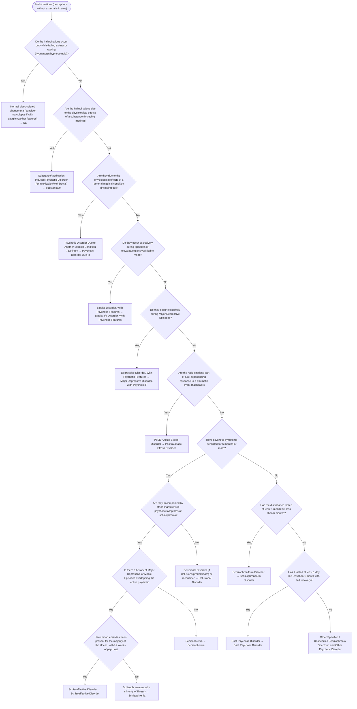

# 2.6 — Hallucinations

**Presenting symptom:** Hallucinations (perceptions without external stimulus)

> Distinguish true hallucinations from normal experiences (hypnagogic/hypnopompic phenomena, intense imagery) and illusions. The branching parallels the delusions tree: rule out substance and medical etiologies, then use the mood/psychosis relationship to differentiate the primary disorders. Hallucinations in clear consciousness confined to one modality, or occurring only at sleep-wake transitions, have distinct implications.

## Decision flow

## Decision points

- **Do the hallucinations occur only while falling asleep or waking (hypnagogic/hypnopompic)?**
  - **Yes →** Normal sleep-related phenomena (consider narcolepsy if with cataplexy/other features) — _[Narcolepsy (if other features present)](hypersomnolence.md)_
  - **No →** Are the hallucinations due to the physiological effects of a substance (including medication or withdrawal)?
- **Are the hallucinations due to the physiological effects of a substance (including medication or withdrawal)?**
  - **Yes →** Substance/Medication-Induced Psychotic Disorder (or intoxication/withdrawal) — _[Substance/Medication-Induced Psychotic Disorder](excessive-substance-use.md)_
  - **No →** Are they due to the physiological effects of a general medical condition (including delirium)?
- **Are they due to the physiological effects of a general medical condition (including delirium)?**
  - **Yes →** Psychotic Disorder Due to Another Medical Condition / Delirium — _[Psychotic Disorder Due to Another Medical Condition](etiological-medical-conditions.md); [Delirium](../tables/3-16-1.md)_
  - **No →** Do they occur exclusively during episodes of elevated/expansive/irritable mood?
- **Do they occur exclusively during episodes of elevated/expansive/irritable mood?**
  - **Yes →** Bipolar Disorder, With Psychotic Features — _[Bipolar I/II Disorder, With Psychotic Features](../tables/3-3-1.md)_
  - **No →** Do they occur exclusively during Major Depressive Episodes?
- **Do they occur exclusively during Major Depressive Episodes?**
  - **Yes →** Depressive Disorder, With Psychotic Features — _[Major Depressive Disorder, With Psychotic Features](../tables/3-4-1.md)_
  - **No →** Are the hallucinations part of a re-experiencing response to a traumatic event (flashbacks)?
- **Are the hallucinations part of a re-experiencing response to a traumatic event (flashbacks)?**
  - **Yes →** PTSD / Acute Stress Disorder — _[Posttraumatic Stress Disorder](../tables/3-7-1.md)_
  - **No →** Have psychotic symptoms persisted for 6 months or more?
- **Have psychotic symptoms persisted for 6 months or more?**
  - **Yes →** Are they accompanied by other characteristic psychotic symptoms of schizophrenia?
  - **No →** Has the disturbance lasted at least 1 month but less than 6 months?
- **Are they accompanied by other characteristic psychotic symptoms of schizophrenia?**
  - **Yes →** Is there a history of Major Depressive or Manic Episodes overlapping the active psychotic period?
  - **No →** Delusional Disorder (if delusions predominate) or reconsider — _[Delusional Disorder](../tables/3-2-3.md)_
- **Is there a history of Major Depressive or Manic Episodes overlapping the active psychotic period?**
  - **Yes →** Have mood episodes been present for the majority of the illness, with ≥2 weeks of psychosis without a mood episode?
  - **No →** Schizophrenia — _[Schizophrenia](../tables/3-2-1.md)_
- **Have mood episodes been present for the majority of the illness, with ≥2 weeks of psychosis without a mood episode?**
  - **Yes →** Schizoaffective Disorder — _[Schizoaffective Disorder](../tables/3-2-2.md)_
  - **No →** Schizophrenia (mood a minority of illness) — _[Schizophrenia](../tables/3-2-1.md)_
- **Has the disturbance lasted at least 1 month but less than 6 months?**
  - **Yes →** Schizophreniform Disorder — _[Schizophreniform Disorder](../tables/3-2-1.md)_
  - **No →** Has it lasted at least 1 day but less than 1 month with full recovery?
- **Has it lasted at least 1 day but less than 1 month with full recovery?**
  - **Yes →** Brief Psychotic Disorder — _[Brief Psychotic Disorder](../tables/3-2-4.md)_
  - **No →** Other Specified / Unspecified Schizophrenia Spectrum and Other Psychotic Disorder

---
_Summarizes differentiating features only. Confirm against the full DSM-5 criteria. See [the six-step method](../framework.md)._
