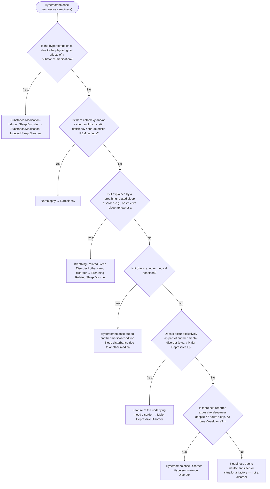

# 2.20 — Hypersomnolence

**Presenting symptom:** Hypersomnolence (excessive sleepiness)

> Excessive daytime sleepiness can arise from insufficient sleep, substances, other sleep disorders (notably narcolepsy and breathing-related sleep disorder), medical conditions, and mood disorders. Cataplexy, sleep paralysis, and hypnagogic hallucinations point specifically to narcolepsy.

## Decision flow

## Decision points

- **Is the hypersomnolence due to the physiological effects of a substance/medication?**
  - **Yes →** Substance/Medication-Induced Sleep Disorder — _[Substance/Medication-Induced Sleep Disorder](excessive-substance-use.md)_
  - **No →** Is there cataplexy and/or evidence of hypocretin deficiency / characteristic REM findings?
- **Is there cataplexy and/or evidence of hypocretin deficiency / characteristic REM findings?**
  - **Yes →** Narcolepsy — _Narcolepsy_
  - **No →** Is it explained by a breathing-related sleep disorder (e.g., obstructive sleep apnea) or another sleep disorder?
- **Is it explained by a breathing-related sleep disorder (e.g., obstructive sleep apnea) or another sleep disorder?**
  - **Yes →** Breathing-Related Sleep Disorder / other sleep disorder — _Breathing-Related Sleep Disorder_
  - **No →** Is it due to another medical condition?
- **Is it due to another medical condition?**
  - **Yes →** Hypersomnolence due to another medical condition — _[Sleep disturbance due to another medical condition](etiological-medical-conditions.md)_
  - **No →** Does it occur exclusively as part of another mental disorder (e.g., a Major Depressive Episode with hypersomnia)?
- **Does it occur exclusively as part of another mental disorder (e.g., a Major Depressive Episode with hypersomnia)?**
  - **Yes →** Feature of the underlying mood disorder — _[Major Depressive Disorder](../tables/3-4-1.md)_
  - **No →** Is there self-reported excessive sleepiness despite ≥7 hours sleep, ≥3 times/week for ≥3 months, with impairment (independent focus)?
- **Is there self-reported excessive sleepiness despite ≥7 hours sleep, ≥3 times/week for ≥3 months, with impairment (independent focus)?**
  - **Yes →** Hypersomnolence Disorder — _[Hypersomnolence Disorder](../tables/3-11-2.md)_
  - **No →** Sleepiness due to insufficient sleep or situational factors — not a disorder

---
_Original synthesis of differentiating features only — no DSM criteria text reproduced. Confirm against the official DSM-5-TR criteria (e.g. "per DSM-5-TR criteria for …"). See [the six-step method](../framework.md). Decision support for clinician reference/research use — not a diagnostic substitute._
