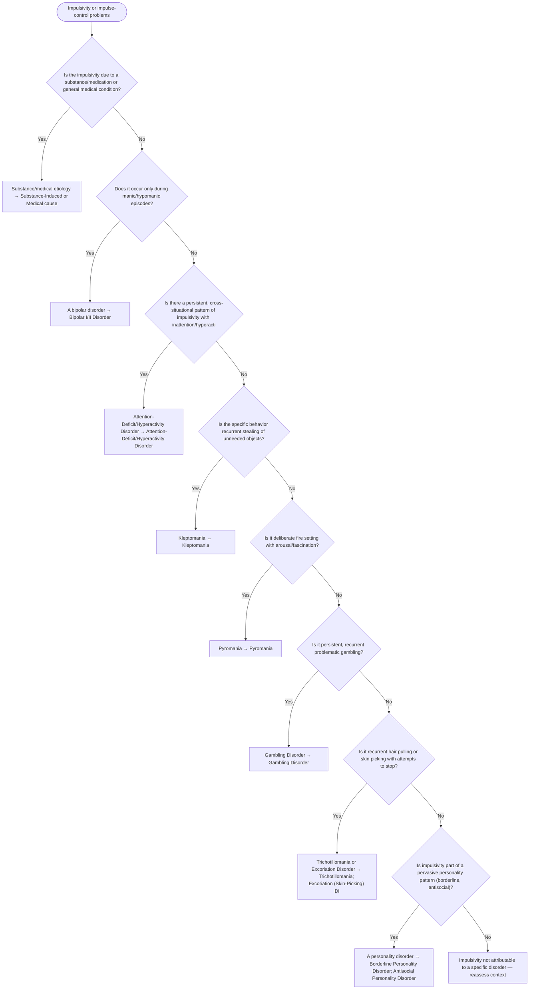

# 2.24 — Impulsivity or Impulse-Control Problems

**Presenting symptom:** Impulsivity or impulse-control problems

> Impulsivity appears across mania, ADHD, substance use, personality disorders, and the discrete impulse-control disorders (each defined by the specific impulsive behavior). Rule out substance/medical causes and episodic mood states, then match the behavior to its disorder (stealing → kleptomania, fire setting → pyromania, gambling → gambling disorder, hair pulling → trichotillomania, skin picking → excoriation).

## Decision flow

## Decision points

- **Is the impulsivity due to a substance/medication or general medical condition?**
  - **Yes →** Substance/medical etiology — _[Substance-Induced or Medical cause](excessive-substance-use.md)_
  - **No →** Does it occur only during manic/hypomanic episodes?
- **Does it occur only during manic/hypomanic episodes?**
  - **Yes →** A bipolar disorder — _[Bipolar I/II Disorder](../tables/3-3-1.md)_
  - **No →** Is there a persistent, cross-situational pattern of impulsivity with inattention/hyperactivity from childhood (ADHD)?
- **Is there a persistent, cross-situational pattern of impulsivity with inattention/hyperactivity from childhood (ADHD)?**
  - **Yes →** Attention-Deficit/Hyperactivity Disorder — _[Attention-Deficit/Hyperactivity Disorder](../tables/3-1-4.md)_
  - **No →** Is the specific behavior recurrent stealing of unneeded objects?
- **Is the specific behavior recurrent stealing of unneeded objects?**
  - **Yes →** Kleptomania — _Kleptomania_
  - **No →** Is it deliberate fire setting with arousal/fascination?
- **Is it deliberate fire setting with arousal/fascination?**
  - **Yes →** Pyromania — _Pyromania_
  - **No →** Is it persistent, recurrent problematic gambling?
- **Is it persistent, recurrent problematic gambling?**
  - **Yes →** Gambling Disorder — _[Gambling Disorder](../tables/3-15-2.md)_
  - **No →** Is it recurrent hair pulling or skin picking with attempts to stop?
- **Is it recurrent hair pulling or skin picking with attempts to stop?**
  - **Yes →** Trichotillomania or Excoriation Disorder — _[Trichotillomania](../tables/3-6-4.md); [Excoriation (Skin-Picking) Disorder](../tables/3-6-5.md)_
  - **No →** Is impulsivity part of a pervasive personality pattern (borderline, antisocial)?
- **Is impulsivity part of a pervasive personality pattern (borderline, antisocial)?**
  - **Yes →** A personality disorder — _[Borderline Personality Disorder](../tables/3-17-5.md); [Antisocial Personality Disorder](../tables/3-17-4.md)_
  - **No →** Impulsivity not attributable to a specific disorder — reassess context

---
_Original synthesis of differentiating features only — no DSM criteria text reproduced. Confirm against the official DSM-5-TR criteria (e.g. "per DSM-5-TR criteria for …"). See [the six-step method](../framework.md). Decision support for clinician reference/research use — not a diagnostic substitute._
