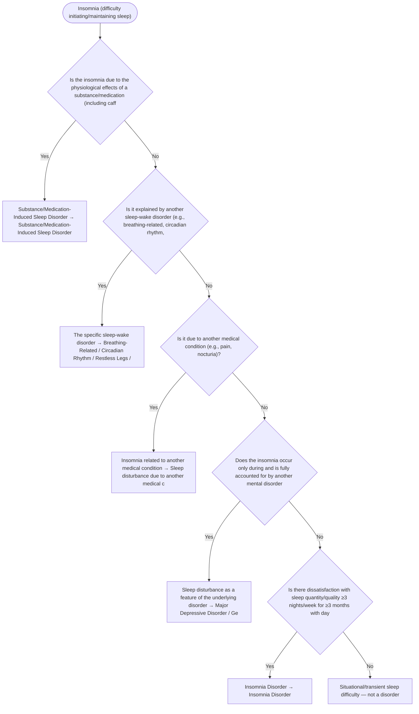

# 2.19 — Insomnia

**Presenting symptom:** Insomnia (difficulty initiating/maintaining sleep)

> Determine whether insomnia is due to a substance/medication, another sleep-wake disorder (e.g., a breathing-related or circadian disorder), or a coexisting mental disorder, or whether it is a persistent, independent insomnia disorder. DSM-5 allows insomnia disorder to be diagnosed alongside comorbid conditions when it is an independent focus of treatment.

## Decision flow

## Decision points

- **Is the insomnia due to the physiological effects of a substance/medication (including caffeine, withdrawal)?**
  - **Yes →** Substance/Medication-Induced Sleep Disorder — _[Substance/Medication-Induced Sleep Disorder](excessive-substance-use.md)_
  - **No →** Is it explained by another sleep-wake disorder (e.g., breathing-related, circadian rhythm, restless legs)?
- **Is it explained by another sleep-wake disorder (e.g., breathing-related, circadian rhythm, restless legs)?**
  - **Yes →** The specific sleep-wake disorder — _Breathing-Related / Circadian Rhythm / Restless Legs / other sleep disorder_
  - **No →** Is it due to another medical condition (e.g., pain, nocturia)?
- **Is it due to another medical condition (e.g., pain, nocturia)?**
  - **Yes →** Insomnia related to another medical condition — _[Sleep disturbance due to another medical condition](etiological-medical-conditions.md)_
  - **No →** Does the insomnia occur only during and is fully accounted for by another mental disorder (e.g., MDD, GAD)?
- **Does the insomnia occur only during and is fully accounted for by another mental disorder (e.g., MDD, GAD)?**
  - **Yes →** Sleep disturbance as a feature of the underlying disorder — _[Major Depressive Disorder / Generalized Anxiety Disorder](../tables/3-4-1.md)_
  - **No →** Is there dissatisfaction with sleep quantity/quality ≥3 nights/week for ≥3 months with daytime impairment (independent focus)?
- **Is there dissatisfaction with sleep quantity/quality ≥3 nights/week for ≥3 months with daytime impairment (independent focus)?**
  - **Yes →** Insomnia Disorder — _[Insomnia Disorder](../tables/3-11-1.md)_
  - **No →** Situational/transient sleep difficulty — not a disorder

---
_Original synthesis of differentiating features only — no DSM criteria text reproduced. Confirm against the official DSM-5-TR criteria (e.g. "per DSM-5-TR criteria for …"). See [the six-step method](../framework.md). Decision support for clinician reference/research use — not a diagnostic substitute._
