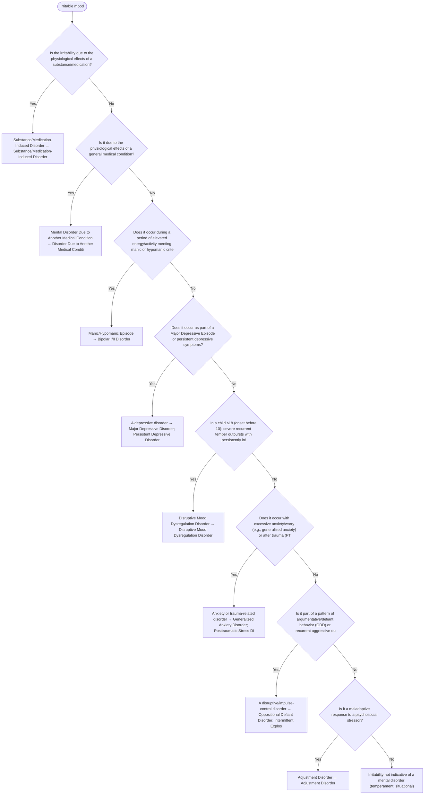

# 2.9 — Irritable Mood

**Presenting symptom:** Irritable mood

> Irritability is highly nonspecific and appears in mania, depression, anxiety, disruptive disorders, DMDD, personality disorders, PTSD, and as a normal reaction. Rule out substance/medical causes, then determine whether irritability marks a manic or depressive episode before considering the developmental and disruptive disorders.

## Decision flow

## Decision points

- **Is the irritability due to the physiological effects of a substance/medication?**
  - **Yes →** Substance/Medication-Induced Disorder — _[Substance/Medication-Induced Disorder](excessive-substance-use.md)_
  - **No →** Is it due to the physiological effects of a general medical condition?
- **Is it due to the physiological effects of a general medical condition?**
  - **Yes →** Mental Disorder Due to Another Medical Condition — _[Disorder Due to Another Medical Condition](etiological-medical-conditions.md)_
  - **No →** Does it occur during a period of elevated energy/activity meeting manic or hypomanic criteria?
- **Does it occur during a period of elevated energy/activity meeting manic or hypomanic criteria?**
  - **Yes →** Manic/Hypomanic Episode — _[Bipolar I/II Disorder](../tables/3-3-1.md)_
  - **No →** Does it occur as part of a Major Depressive Episode or persistent depressive symptoms?
- **Does it occur as part of a Major Depressive Episode or persistent depressive symptoms?**
  - **Yes →** A depressive disorder — _[Major Depressive Disorder](../tables/3-4-1.md); [Persistent Depressive Disorder](../tables/3-4-2.md)_
  - **No →** In a child ≤18 (onset before 10): severe recurrent temper outbursts with persistently irritable/angry mood between them, ≥12 months?
- **In a child ≤18 (onset before 10): severe recurrent temper outbursts with persistently irritable/angry mood between them, ≥12 months?**
  - **Yes →** Disruptive Mood Dysregulation Disorder — _[Disruptive Mood Dysregulation Disorder](../tables/3-4-4.md)_
  - **No →** Does it occur with excessive anxiety/worry (e.g., generalized anxiety) or after trauma (PTSD)?
- **Does it occur with excessive anxiety/worry (e.g., generalized anxiety) or after trauma (PTSD)?**
  - **Yes →** Anxiety or trauma-related disorder — _[Generalized Anxiety Disorder](../tables/3-5-7.md); [Posttraumatic Stress Disorder](../tables/3-7-1.md)_
  - **No →** Is it part of a pattern of argumentative/defiant behavior (ODD) or recurrent aggressive outbursts (intermittent explosive disorder)?
- **Is it part of a pattern of argumentative/defiant behavior (ODD) or recurrent aggressive outbursts (intermittent explosive disorder)?**
  - **Yes →** A disruptive/impulse-control disorder — _[Oppositional Defiant Disorder](../tables/3-14-1.md); [Intermittent Explosive Disorder](../tables/3-14-2.md)_
  - **No →** Is it a maladaptive response to a psychosocial stressor?
- **Is it a maladaptive response to a psychosocial stressor?**
  - **Yes →** Adjustment Disorder — _[Adjustment Disorder](../tables/3-7-2.md)_
  - **No →** Irritability not indicative of a mental disorder (temperament, situational)

---
_Original synthesis of differentiating features only — no DSM criteria text reproduced. Confirm against the official DSM-5-TR criteria (e.g. "per DSM-5-TR criteria for …"). See [the six-step method](../framework.md). Decision support for clinician reference/research use — not a diagnostic substitute._
