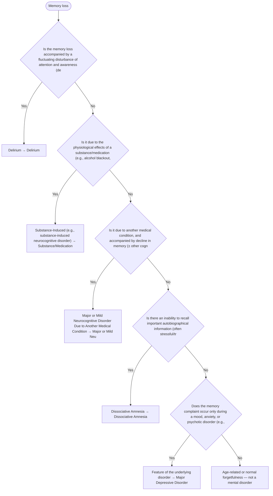

# 2.27 — Memory Loss

**Presenting symptom:** Memory loss

> Distinguish amnesia due to a medical condition (including delirium and neurocognitive disorders) or a substance from dissociative amnesia (psychogenic, often for autobiographical/traumatic information, without a neurological basis) and from normal age-related forgetfulness. The presence/absence of other cognitive deficits, level of consciousness, and the nature of the forgotten material guide the differential.

## Decision flow

## Decision points

- **Is the memory loss accompanied by a fluctuating disturbance of attention and awareness (delirium)?**
  - **Yes →** Delirium — _[Delirium](../tables/3-16-1.md)_
  - **No →** Is it due to the physiological effects of a substance/medication (e.g., alcohol blackout, benzodiazepines)?
- **Is it due to the physiological effects of a substance/medication (e.g., alcohol blackout, benzodiazepines)?**
  - **Yes →** Substance-Induced (e.g., substance-induced neurocognitive disorder) — _[Substance/Medication-Induced Neurocognitive Disorder](excessive-substance-use.md)_
  - **No →** Is it due to another medical condition, and accompanied by decline in memory (± other cognitive domains)?
- **Is it due to another medical condition, and accompanied by decline in memory (± other cognitive domains)?**
  - **Yes →** Major or Mild Neurocognitive Disorder Due to Another Medical Condition — _[Major or Mild Neurocognitive Disorder](../tables/3-16-2.md)_
  - **No →** Is there an inability to recall important autobiographical information (often stressful/traumatic), too extensive for ordinary forgetting, without a neurological cause?
- **Is there an inability to recall important autobiographical information (often stressful/traumatic), too extensive for ordinary forgetting, without a neurological cause?**
  - **Yes →** Dissociative Amnesia — _[Dissociative Amnesia](../tables/3-8-1.md)_
  - **No →** Does the memory complaint occur only during a mood, anxiety, or psychotic disorder (e.g., poor concentration in depression)?
- **Does the memory complaint occur only during a mood, anxiety, or psychotic disorder (e.g., poor concentration in depression)?**
  - **Yes →** Feature of the underlying disorder — _[Major Depressive Disorder](../tables/3-4-1.md)_
  - **No →** Age-related or normal forgetfulness — not a mental disorder

---
_Summarizes differentiating features only. Confirm against the full DSM-5 criteria. See [the six-step method](../framework.md)._
