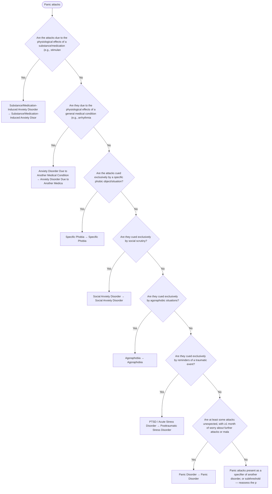

# 2.14 — Panic Attacks

**Presenting symptom:** Panic attacks

> A panic attack is a symptom, not a disorder, and can occur in any anxiety disorder and many other conditions. The key distinction is between UNEXPECTED attacks (occurring without an obvious cue) and EXPECTED attacks (cued by a feared object/situation). Recurrent unexpected attacks plus anticipatory worry define panic disorder; expected attacks point to the disorder tied to their trigger.

## Decision flow

## Decision points

- **Are the attacks due to the physiological effects of a substance/medication (e.g., stimulant, caffeine, withdrawal)?**
  - **Yes →** Substance/Medication-Induced Anxiety Disorder — _[Substance/Medication-Induced Anxiety Disorder](excessive-substance-use.md)_
  - **No →** Are they due to the physiological effects of a general medical condition (e.g., arrhythmia, hyperthyroidism, pheochromocytoma)?
- **Are they due to the physiological effects of a general medical condition (e.g., arrhythmia, hyperthyroidism, pheochromocytoma)?**
  - **Yes →** Anxiety Disorder Due to Another Medical Condition — _[Anxiety Disorder Due to Another Medical Condition](etiological-medical-conditions.md)_
  - **No →** Are the attacks cued exclusively by a specific phobic object/situation?
- **Are the attacks cued exclusively by a specific phobic object/situation?**
  - **Yes →** Specific Phobia — _[Specific Phobia](../tables/3-5-3.md)_
  - **No →** Are they cued exclusively by social scrutiny?
- **Are they cued exclusively by social scrutiny?**
  - **Yes →** Social Anxiety Disorder — _[Social Anxiety Disorder](../tables/3-5-4.md)_
  - **No →** Are they cued exclusively by agoraphobic situations?
- **Are they cued exclusively by agoraphobic situations?**
  - **Yes →** Agoraphobia — _[Agoraphobia](../tables/3-5-6.md)_
  - **No →** Are they cued exclusively by reminders of a traumatic event?
- **Are they cued exclusively by reminders of a traumatic event?**
  - **Yes →** PTSD / Acute Stress Disorder — _[Posttraumatic Stress Disorder](../tables/3-7-1.md)_
  - **No →** Are at least some attacks unexpected, with ≥1 month of worry about further attacks or maladaptive change in behavior?
- **Are at least some attacks unexpected, with ≥1 month of worry about further attacks or maladaptive change in behavior?**
  - **Yes →** Panic Disorder — _[Panic Disorder](../tables/3-5-5.md)_
  - **No →** Panic attacks present as a specifier of another disorder, or subthreshold — reassess the primary condition

---
_Summarizes differentiating features only. Confirm against the full DSM-5 criteria. See [the six-step method](../framework.md)._
