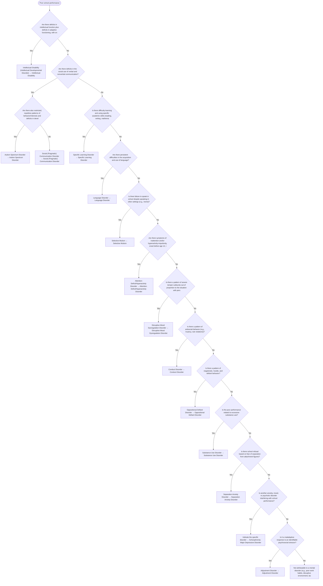

# 2.1 — Poor School Performance

**Presenting symptom:** Poor school performance

> Poor academic performance is common and nonspecific. Most childhood mental disorders can impair it, and it is frequently the chief complaint — but it is not itself a disorder. Evaluation typically pairs cognitive/achievement testing with a careful history from parents, teachers, and clinicians. Because neurodevelopmental and other disorders often co-occur, traverse the tree more than once and assign every applicable diagnosis.

## Decision flow

## Decision points

- **Are there deficits in intellectual function plus deficits in adaptive functioning, with onset during the developmental period?**
  - **Yes →** Intellectual Disability (Intellectual Developmental Disorder) — _[Intellectual Disability](../tables/3-1-1.md)_
  - **No →** Are there deficits in the social use of verbal and nonverbal communication?
- **Are there deficits in the social use of verbal and nonverbal communication?**
  - _If accompanied by restricted/repetitive behavior and deficits in relationships and social-emotional reciprocity, consider Autism Spectrum Disorder; otherwise Social (Pragmatic) Communication Disorder._
  - **Yes →** Are there also restricted, repetitive patterns of behavior/interests and deficits in developing/understanding relationships?
  - **No →** Is there difficulty learning and using specific academic skills (reading, writing, mathematics)?
- **Are there also restricted, repetitive patterns of behavior/interests and deficits in developing/understanding relationships?**
  - **Yes →** Autism Spectrum Disorder — _[Autism Spectrum Disorder](../tables/3-1-3.md)_
  - **No →** Social (Pragmatic) Communication Disorder — _[Social (Pragmatic) Communication Disorder](../tables/3-1-2.md)_
- **Is there difficulty learning and using specific academic skills (reading, writing, mathematics)?**
  - **Yes →** Specific Learning Disorder — _[Specific Learning Disorder](../tables/3-1-5.md)_
  - **No →** Are there persistent difficulties in the acquisition and use of language?
- **Are there persistent difficulties in the acquisition and use of language?**
  - **Yes →** Language Disorder — _[Language Disorder](../tables/3-1-2.md)_
  - **No →** Is there failure to speak in school despite speaking in other settings (e.g., home)?
- **Is there failure to speak in school despite speaking in other settings (e.g., home)?**
  - **Yes →** Selective Mutism — _[Selective Mutism](../tables/3-5-2.md)_
  - **No →** Are there symptoms of inattention and/or hyperactivity-impulsivity, onset before age 12, interfering with functioning across settings?
- **Are there symptoms of inattention and/or hyperactivity-impulsivity, onset before age 12, interfering with functioning across settings?**
  - **Yes →** Attention-Deficit/Hyperactivity Disorder — _[Attention-Deficit/Hyperactivity Disorder](../tables/3-1-4.md)_
  - **No →** Is there a pattern of severe temper outbursts out of proportion to the situation with persistent anger/irritability between outbursts?
- **Is there a pattern of severe temper outbursts out of proportion to the situation with persistent anger/irritability between outbursts?**
  - **Yes →** Disruptive Mood Dysregulation Disorder — _[Disruptive Mood Dysregulation Disorder](../tables/3-4-4.md)_
  - **No →** Is there a pattern of antisocial behavior (e.g., truancy, rule violations)?
- **Is there a pattern of antisocial behavior (e.g., truancy, rule violations)?**
  - **Yes →** Conduct Disorder — _[Conduct Disorder](../tables/3-14-3.md)_
  - **No →** Is there a pattern of negativistic, hostile, and defiant behavior?
- **Is there a pattern of negativistic, hostile, and defiant behavior?**
  - **Yes →** Oppositional Defiant Disorder — _[Oppositional Defiant Disorder](../tables/3-14-1.md)_
  - **No →** Is the poor performance related to excessive substance use?
- **Is the poor performance related to excessive substance use?**
  - **Yes →** Substance Use Disorder — _[Substance Use Disorder](../tables/3-15-1.md)_
  - **No →** Is there school refusal based on fear of separation from attachment figures?
- **Is there school refusal based on fear of separation from attachment figures?**
  - **Yes →** Separation Anxiety Disorder — _[Separation Anxiety Disorder](../tables/3-5-1.md)_
  - **No →** Is another anxiety, mood, or psychotic disorder interfering with school performance?
- **Is another anxiety, mood, or psychotic disorder interfering with school performance?**
  - **Yes →** Indicate the specific disorder — _[Schizophrenia](../tables/3-2-1.md); [Major Depressive Disorder](../tables/3-4-1.md)_
  - **No →** Is it a maladaptive response to an identifiable psychosocial stressor?
- **Is it a maladaptive response to an identifiable psychosocial stressor?**
  - **Yes →** Adjustment Disorder — _[Adjustment Disorder](../tables/3-7-2.md)_
  - **No →** Not attributable to a mental disorder (e.g., poor work habits, disruptive environment, lack of motivation)

---
_Original synthesis of differentiating features only — no DSM criteria text reproduced. Confirm against the official DSM-5-TR criteria (e.g. "per DSM-5-TR criteria for …"). See [the six-step method](../framework.md). Decision support for clinician reference/research use — not a diagnostic substitute._
