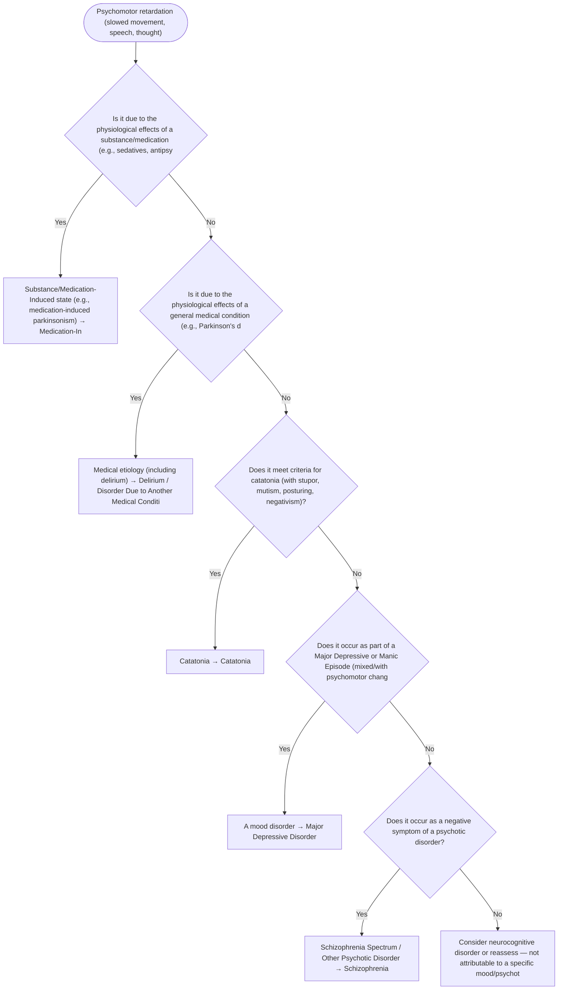

# 2.12 — Psychomotor Retardation

**Presenting symptom:** Psychomotor retardation (slowed movement, speech, thought)

> Slowing of movement and thought can reflect depression, catatonia, parkinsonism (including medication-induced), hypoactive delirium, neurocognitive disorders, and negative symptoms of psychosis. Rule out substance/medication (e.g., neuroleptics) and medical causes before attributing it to a primary mood or psychotic disorder.

## Decision flow

## Decision points

- **Is it due to the physiological effects of a substance/medication (e.g., sedatives, antipsychotic-induced parkinsonism)?**
  - **Yes →** Substance/Medication-Induced state (e.g., medication-induced parkinsonism) — _[Medication-Induced Movement Disorder / Substance-Induced state](excessive-substance-use.md)_
  - **No →** Is it due to the physiological effects of a general medical condition (e.g., Parkinson's disease, hypothyroidism, hypoactive delirium)?
- **Is it due to the physiological effects of a general medical condition (e.g., Parkinson's disease, hypothyroidism, hypoactive delirium)?**
  - **Yes →** Medical etiology (including delirium) — _[Delirium / Disorder Due to Another Medical Condition](../tables/3-16-1.md)_
  - **No →** Does it meet criteria for catatonia (with stupor, mutism, posturing, negativism)?
- **Does it meet criteria for catatonia (with stupor, mutism, posturing, negativism)?**
  - **Yes →** Catatonia — _[Catatonia](../tables/3-2-5.md)_
  - **No →** Does it occur as part of a Major Depressive or Manic Episode (mixed/with psychomotor changes)?
- **Does it occur as part of a Major Depressive or Manic Episode (mixed/with psychomotor changes)?**
  - **Yes →** A mood disorder — _[Major Depressive Disorder](../tables/3-4-1.md)_
  - **No →** Does it occur as a negative symptom of a psychotic disorder?
- **Does it occur as a negative symptom of a psychotic disorder?**
  - **Yes →** Schizophrenia Spectrum / Other Psychotic Disorder — _[Schizophrenia](../tables/3-2-1.md)_
  - **No →** Consider neurocognitive disorder or reassess — not attributable to a specific mood/psychotic disorder

---
_Original synthesis of differentiating features only — no DSM criteria text reproduced. Confirm against the official DSM-5-TR criteria (e.g. "per DSM-5-TR criteria for …"). See [the six-step method](../framework.md). Decision support for clinician reference/research use — not a diagnostic substitute._
