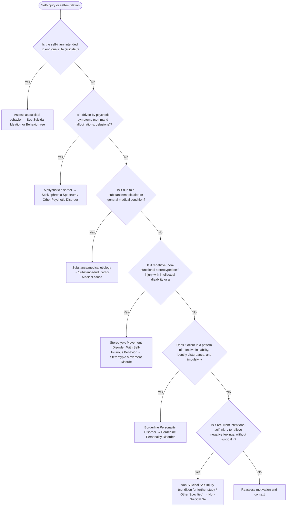

# 2.25 — Self-Injury or Self-Mutilation

**Presenting symptom:** Self-injury or self-mutilation

> Non-suicidal self-injury must be distinguished from suicidal behavior (see the suicidal ideation tree) and understood in its diagnostic context. Self-injury occurs with borderline personality disorder, in response to command hallucinations or delusions, in the context of stereotypies (intellectual disability, autism), and as a stress-related behavior. Always assess suicide risk in parallel.

## Decision flow

## Decision points

- **Is the self-injury intended to end one's life (suicidal)?**
  - **Yes →** Assess as suicidal behavior — _[See Suicidal Ideation or Behavior tree](suicidal-ideation-behavior.md)_
  - **No →** Is it driven by psychotic symptoms (command hallucinations, delusions)?
- **Is it driven by psychotic symptoms (command hallucinations, delusions)?**
  - **Yes →** A psychotic disorder — _[Schizophrenia Spectrum / Other Psychotic Disorder](../tables/3-2-1.md)_
  - **No →** Is it due to a substance/medication or general medical condition?
- **Is it due to a substance/medication or general medical condition?**
  - **Yes →** Substance/medical etiology — _[Substance-Induced or Medical cause](etiological-medical-conditions.md)_
  - **No →** Is it repetitive, non-functional stereotyped self-injury with intellectual disability or autism?
- **Is it repetitive, non-functional stereotyped self-injury with intellectual disability or autism?**
  - **Yes →** Stereotypic Movement Disorder, With Self-Injurious Behavior — _Stereotypic Movement Disorder_
  - **No →** Does it occur in a pattern of affective instability, identity disturbance, and impulsivity?
- **Does it occur in a pattern of affective instability, identity disturbance, and impulsivity?**
  - **Yes →** Borderline Personality Disorder — _[Borderline Personality Disorder](../tables/3-17-5.md)_
  - **No →** Is it recurrent intentional self-injury to relieve negative feelings, without suicidal intent, and not better explained above?
- **Is it recurrent intentional self-injury to relieve negative feelings, without suicidal intent, and not better explained above?**
  - **Yes →** Non-Suicidal Self-Injury (condition for further study / Other Specified) — _Non-Suicidal Self-Injury_
  - **No →** Reassess motivation and context

---
_Summarizes differentiating features only. Confirm against the full DSM-5 criteria. See [the six-step method](../framework.md)._
