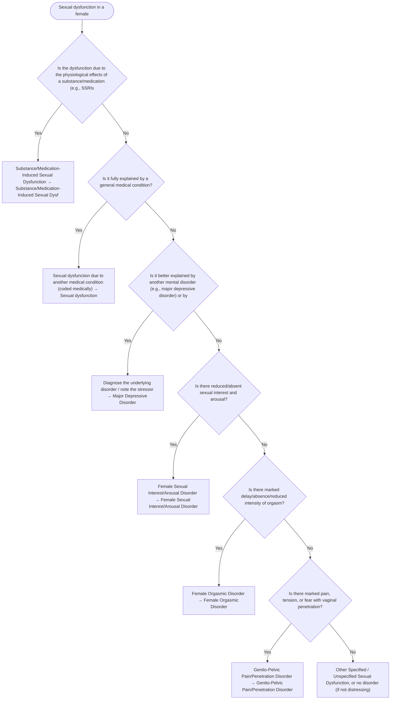

# 2.21 — Sexual Dysfunction in a Female

**Presenting symptom:** Sexual dysfunction in a female

> Sexual dysfunctions require clinically significant distress and typically ≥6 months' duration. Exclude substance/medication effects, medical conditions, severe relationship distress, and other mental disorders that better account for the problem before diagnosing a primary sexual dysfunction, which is then specified by the phase/nature of the difficulty.

## Decision flow

## Decision points

- **Is the dysfunction due to the physiological effects of a substance/medication (e.g., SSRIs)?**
  - **Yes →** Substance/Medication-Induced Sexual Dysfunction — _[Substance/Medication-Induced Sexual Dysfunction](../tables/3-12-1.md)_
  - **No →** Is it fully explained by a general medical condition?
- **Is it fully explained by a general medical condition?**
  - **Yes →** Sexual dysfunction due to another medical condition (coded medically) — _[Sexual dysfunction attributable to a medical condition](etiological-medical-conditions.md)_
  - **No →** Is it better explained by another mental disorder (e.g., major depressive disorder) or by severe relationship distress/other stressors?
- **Is it better explained by another mental disorder (e.g., major depressive disorder) or by severe relationship distress/other stressors?**
  - **Yes →** Diagnose the underlying disorder / note the stressor — _[Major Depressive Disorder](../tables/3-4-1.md)_
  - **No →** Is there reduced/absent sexual interest and arousal?
- **Is there reduced/absent sexual interest and arousal?**
  - **Yes →** Female Sexual Interest/Arousal Disorder — _[Female Sexual Interest/Arousal Disorder](../tables/3-12-1.md)_
  - **No →** Is there marked delay/absence/reduced intensity of orgasm?
- **Is there marked delay/absence/reduced intensity of orgasm?**
  - **Yes →** Female Orgasmic Disorder — _[Female Orgasmic Disorder](../tables/3-12-1.md)_
  - **No →** Is there marked pain, tension, or fear with vaginal penetration?
- **Is there marked pain, tension, or fear with vaginal penetration?**
  - **Yes →** Genito-Pelvic Pain/Penetration Disorder — _[Genito-Pelvic Pain/Penetration Disorder](../tables/3-12-1.md)_
  - **No →** Other Specified / Unspecified Sexual Dysfunction, or no disorder (if not distressing)

---
_Summarizes differentiating features only. Confirm against the full DSM-5 criteria. See [the six-step method](../framework.md)._
