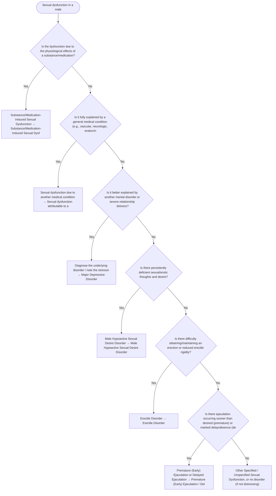

# 2.22 — Sexual Dysfunction in a Male

**Presenting symptom:** Sexual dysfunction in a male

> As with female sexual dysfunctions, require clinically significant distress and typically ≥6 months' duration, and exclude substance/medication effects, medical conditions, severe relationship distress, and other mental disorders before diagnosing a primary male sexual dysfunction, specified by desire, arousal/erectile, or ejaculatory phase.

## Decision flow

## Decision points

- **Is the dysfunction due to the physiological effects of a substance/medication?**
  - **Yes →** Substance/Medication-Induced Sexual Dysfunction — _[Substance/Medication-Induced Sexual Dysfunction](../tables/3-12-1.md)_
  - **No →** Is it fully explained by a general medical condition (e.g., vascular, neurologic, endocrine)?
- **Is it fully explained by a general medical condition (e.g., vascular, neurologic, endocrine)?**
  - **Yes →** Sexual dysfunction due to another medical condition — _[Sexual dysfunction attributable to a medical condition](etiological-medical-conditions.md)_
  - **No →** Is it better explained by another mental disorder or severe relationship distress?
- **Is it better explained by another mental disorder or severe relationship distress?**
  - **Yes →** Diagnose the underlying disorder / note the stressor — _[Major Depressive Disorder](../tables/3-4-1.md)_
  - **No →** Is there persistently deficient sexual/erotic thoughts and desire?
- **Is there persistently deficient sexual/erotic thoughts and desire?**
  - **Yes →** Male Hypoactive Sexual Desire Disorder — _[Male Hypoactive Sexual Desire Disorder](../tables/3-12-1.md)_
  - **No →** Is there difficulty obtaining/maintaining an erection or reduced erectile rigidity?
- **Is there difficulty obtaining/maintaining an erection or reduced erectile rigidity?**
  - **Yes →** Erectile Disorder — _[Erectile Disorder](../tables/3-12-1.md)_
  - **No →** Is there ejaculation occurring sooner than desired (premature) or marked delay/absence (delayed)?
- **Is there ejaculation occurring sooner than desired (premature) or marked delay/absence (delayed)?**
  - **Yes →** Premature (Early) Ejaculation or Delayed Ejaculation — _[Premature (Early) Ejaculation / Delayed Ejaculation](../tables/3-12-1.md)_
  - **No →** Other Specified / Unspecified Sexual Dysfunction, or no disorder (if not distressing)

---
_Original synthesis of differentiating features only — no DSM criteria text reproduced. Confirm against the official DSM-5-TR criteria (e.g. "per DSM-5-TR criteria for …"). See [the six-step method](../framework.md). Decision support for clinician reference/research use — not a diagnostic substitute._
