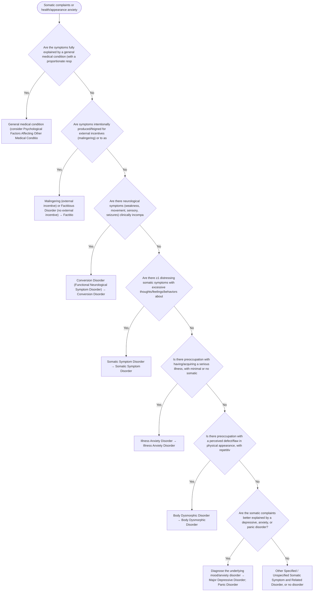

# 2.17 — Somatic Complaints or Illness/Appearance Anxiety

**Presenting symptom:** Somatic complaints or health/appearance anxiety

> First ensure a general medical condition has been appropriately evaluated. The somatic symptom and related disorders are differentiated by whether distressing somatic symptoms are present, whether the focus is on having/acquiring a serious illness versus the symptoms themselves, whether there is deceptive symptom production, and whether neurological symptoms are incompatible with recognized disease.

## Decision flow

## Decision points

- **Are the symptoms fully explained by a general medical condition (with a proportionate response)?**
  - **Yes →** General medical condition (consider Psychological Factors Affecting Other Medical Conditions if psychological factors adversely affect it) — _[Psychological Factors Affecting Other Medical Conditions](../tables/3-9-4.md)_
  - **No →** Are symptoms intentionally produced/feigned for external incentives (malingering) or to assume the sick role (factitious)?
- **Are symptoms intentionally produced/feigned for external incentives (malingering) or to assume the sick role (factitious)?**
  - **Yes →** Malingering (external incentive) or Factitious Disorder (no external incentive) — _[Factitious Disorder](../tables/3-9-5.md)_
  - **No →** Are there neurological symptoms (weakness, movement, sensory, seizures) clinically incompatible with recognized disease?
- **Are there neurological symptoms (weakness, movement, sensory, seizures) clinically incompatible with recognized disease?**
  - **Yes →** Conversion Disorder (Functional Neurological Symptom Disorder) — _[Conversion Disorder](../tables/3-9-3.md)_
  - **No →** Are there ≥1 distressing somatic symptoms with excessive thoughts/feelings/behaviors about them?
- **Are there ≥1 distressing somatic symptoms with excessive thoughts/feelings/behaviors about them?**
  - **Yes →** Somatic Symptom Disorder — _[Somatic Symptom Disorder](../tables/3-9-1.md)_
  - **No →** Is there preoccupation with having/acquiring a serious illness, with minimal or no somatic symptoms and high health anxiety?
- **Is there preoccupation with having/acquiring a serious illness, with minimal or no somatic symptoms and high health anxiety?**
  - **Yes →** Illness Anxiety Disorder — _[Illness Anxiety Disorder](../tables/3-9-2.md)_
  - **No →** Is there preoccupation with a perceived defect/flaw in physical appearance, with repetitive behaviors?
- **Is there preoccupation with a perceived defect/flaw in physical appearance, with repetitive behaviors?**
  - **Yes →** Body Dysmorphic Disorder — _[Body Dysmorphic Disorder](../tables/3-6-2.md)_
  - **No →** Are the somatic complaints better explained by a depressive, anxiety, or panic disorder?
- **Are the somatic complaints better explained by a depressive, anxiety, or panic disorder?**
  - **Yes →** Diagnose the underlying mood/anxiety disorder — _[Major Depressive Disorder](../tables/3-4-1.md); [Panic Disorder](../tables/3-5-5.md)_
  - **No →** Other Specified / Unspecified Somatic Symptom and Related Disorder, or no disorder

---
_Original synthesis of differentiating features only — no DSM criteria text reproduced. Confirm against the official DSM-5-TR criteria (e.g. "per DSM-5-TR criteria for …"). See [the six-step method](../framework.md). Decision support for clinician reference/research use — not a diagnostic substitute._
