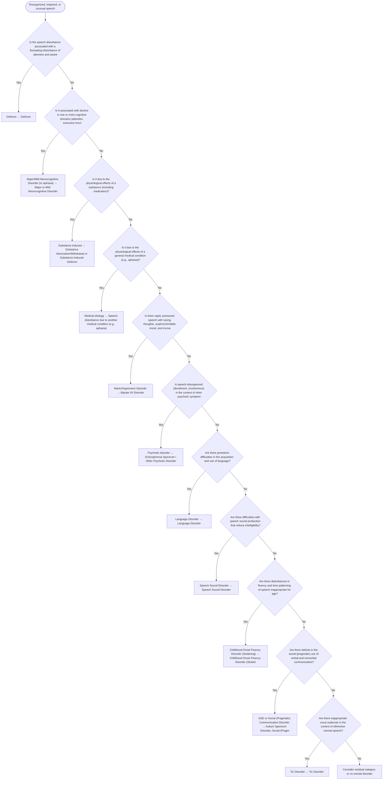

# 2.3 — Speech Disturbance

**Presenting symptom:** Disorganized, impaired, or unusual speech

> Covers disorganized speech (derailment, tangentiality), impaired speech production (language, articulation, fluency), and unusual speech (pragmatic deficits, pressured/repetitive speech). Disorganized speech is hard to judge — if you cannot readily tell whether speech is disorganized, it probably is not pathological. Distinguishing loosening of associations (schizophrenia) from flight of ideas (mania) is best based on accompanying symptoms and course rather than the speech pattern alone.

## Decision flow

## Decision points

- **Is the speech disturbance associated with a fluctuating disturbance of attention and awareness?**
  - **Yes →** Delirium — _[Delirium](../tables/3-16-1.md)_
  - **No →** Is it associated with decline in one or more cognitive domains (attention, executive function, memory, language, perceptual-motor, social cognition)?
- **Is it associated with decline in one or more cognitive domains (attention, executive function, memory, language, perceptual-motor, social cognition)?**
  - **Yes →** Major/Mild Neurocognitive Disorder (or aphasia) — _[Major or Mild Neurocognitive Disorder](../tables/3-16-2.md)_
  - **No →** Is it due to the physiological effects of a substance (including medication)?
- **Is it due to the physiological effects of a substance (including medication)?**
  - **Yes →** Substance-induced — _[Substance Intoxication/Withdrawal or Substance-Induced Delirium](excessive-substance-use.md)_
  - **No →** Is it due to the physiological effects of a general medical condition (e.g., aphasia)?
- **Is it due to the physiological effects of a general medical condition (e.g., aphasia)?**
  - **Yes →** Medical etiology — _[Speech disturbance due to another medical condition (e.g., aphasia)](etiological-medical-conditions.md)_
  - **No →** Is there rapid, pressured speech with racing thoughts, euphoric/irritable mood, and increased energy?
- **Is there rapid, pressured speech with racing thoughts, euphoric/irritable mood, and increased energy?**
  - **Yes →** Manic/Hypomanic Episode — _[Bipolar I/II Disorder](../tables/3-3-1.md)_
  - **No →** Is speech disorganized (derailment, incoherence) in the context of other psychotic symptoms?
- **Is speech disorganized (derailment, incoherence) in the context of other psychotic symptoms?**
  - **Yes →** Psychotic disorder — _[Schizophrenia Spectrum / Other Psychotic Disorder](../tables/3-2-1.md)_
  - **No →** Are there persistent difficulties in the acquisition and use of language?
- **Are there persistent difficulties in the acquisition and use of language?**
  - **Yes →** Language Disorder — _[Language Disorder](../tables/3-1-2.md)_
  - **No →** Are there difficulties with speech sound production that reduce intelligibility?
- **Are there difficulties with speech sound production that reduce intelligibility?**
  - **Yes →** Speech Sound Disorder — _[Speech Sound Disorder](../tables/3-1-2.md)_
  - **No →** Are there disturbances in fluency and time patterning of speech inappropriate for age?
- **Are there disturbances in fluency and time patterning of speech inappropriate for age?**
  - **Yes →** Childhood-Onset Fluency Disorder (Stuttering) — _[Childhood-Onset Fluency Disorder (Stuttering)](../tables/3-1-2.md)_
  - **No →** Are there deficits in the social (pragmatic) use of verbal and nonverbal communication?
- **Are there deficits in the social (pragmatic) use of verbal and nonverbal communication?**
  - **Yes →** ASD or Social (Pragmatic) Communication Disorder — _[Autism Spectrum Disorder](../tables/3-1-3.md); [Social (Pragmatic) Communication Disorder](../tables/3-1-2.md)_
  - **No →** Are there inappropriate vocal outbursts in the context of otherwise normal speech?
- **Are there inappropriate vocal outbursts in the context of otherwise normal speech?**
  - **Yes →** Tic Disorder — _[Tic Disorder](../tables/3-1-6.md)_
  - **No →** Consider residual category or no mental disorder

---
_Summarizes differentiating features only. Confirm against the full DSM-5 criteria. See [the six-step method](../framework.md)._
