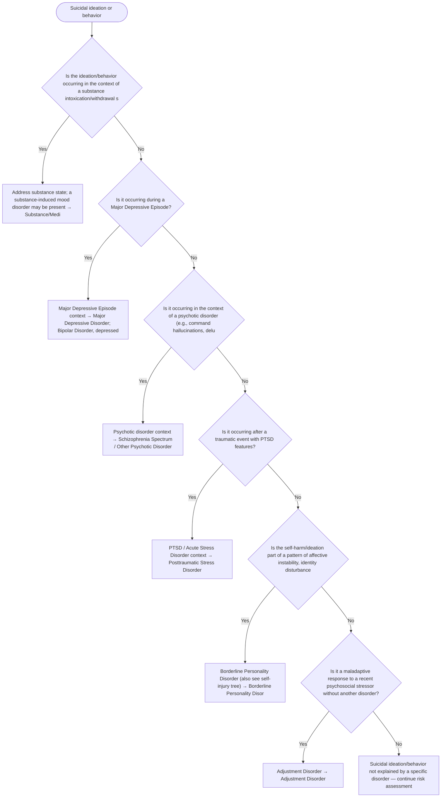

# 2.11 — Suicidal Ideation or Behavior

**Presenting symptom:** Suicidal ideation or behavior

> Suicidal ideation and behavior cut across nearly every diagnostic grouping and demand immediate risk assessment independent of diagnosis. Diagnostically, identify the disorder(s) in which the ideation is occurring; treatment and safety planning take priority over nosology. This tree points to the disorders most commonly associated with suicidality.

## Decision flow

## Decision points

- **Is the ideation/behavior occurring in the context of a substance intoxication/withdrawal state or medication effect?**
  - **Yes →** Address substance state; a substance-induced mood disorder may be present — _[Substance/Medication-Induced Depressive Disorder](excessive-substance-use.md)_
  - **No →** Is it occurring during a Major Depressive Episode?
- **Is it occurring during a Major Depressive Episode?**
  - **Yes →** Major Depressive Episode context — _[Major Depressive Disorder](../tables/3-4-1.md); [Bipolar Disorder, depressed](../tables/3-3-1.md)_
  - **No →** Is it occurring in the context of a psychotic disorder (e.g., command hallucinations, delusions)?
- **Is it occurring in the context of a psychotic disorder (e.g., command hallucinations, delusions)?**
  - **Yes →** Psychotic disorder context — _[Schizophrenia Spectrum / Other Psychotic Disorder](../tables/3-2-1.md)_
  - **No →** Is it occurring after a traumatic event with PTSD features?
- **Is it occurring after a traumatic event with PTSD features?**
  - **Yes →** PTSD / Acute Stress Disorder context — _[Posttraumatic Stress Disorder](../tables/3-7-1.md)_
  - **No →** Is the self-harm/ideation part of a pattern of affective instability, identity disturbance, and impulsivity?
- **Is the self-harm/ideation part of a pattern of affective instability, identity disturbance, and impulsivity?**
  - **Yes →** Borderline Personality Disorder (also see self-injury tree) — _[Borderline Personality Disorder](../tables/3-17-5.md)_
  - **No →** Is it a maladaptive response to a recent psychosocial stressor without another disorder?
- **Is it a maladaptive response to a recent psychosocial stressor without another disorder?**
  - **Yes →** Adjustment Disorder — _[Adjustment Disorder](../tables/3-7-2.md)_
  - **No →** Suicidal ideation/behavior not explained by a specific disorder — continue risk assessment and monitor

---
_Original synthesis of differentiating features only — no DSM criteria text reproduced. Confirm against the official DSM-5-TR criteria (e.g. "per DSM-5-TR criteria for …"). See [the six-step method](../framework.md). Decision support for clinician reference/research use — not a diagnostic substitute._
