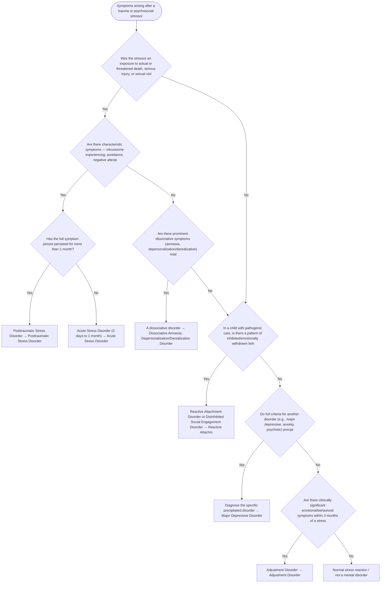

# 2.16 — Trauma or Psychosocial Stressors in the Etiology

**Presenting symptom:** Symptoms arising after a trauma or psychosocial stressor

> When symptoms follow an identifiable stressor, the differential turns on the nature of the stressor (traumatic vs. ordinary), the symptom profile, and timing/duration. Traumatic stressors with characteristic re-experiencing, avoidance, cognition/mood changes, and hyperarousal point to PTSD or acute stress disorder; a broader maladaptive response to a non-traumatic stressor suggests adjustment disorder. Other disorders can also be precipitated by stress.

## Decision flow

## Decision points

- **Was the stressor an exposure to actual or threatened death, serious injury, or sexual violence (a traumatic stressor)?**
  - **Yes →** Are there characteristic symptoms — intrusion/re-experiencing, avoidance, negative alterations in cognition/mood, and arousal?
  - **No →** In a child with pathogenic care, is there a pattern of inhibited/emotionally withdrawn behavior (or indiscriminate social behavior)?
- **Are there characteristic symptoms — intrusion/re-experiencing, avoidance, negative alterations in cognition/mood, and arousal?**
  - **Yes →** Has the full symptom picture persisted for more than 1 month?
  - **No →** Are there prominent dissociative symptoms (amnesia, depersonalization/derealization) related to the trauma?
- **Has the full symptom picture persisted for more than 1 month?**
  - **Yes →** Posttraumatic Stress Disorder — _[Posttraumatic Stress Disorder](../tables/3-7-1.md)_
  - **No →** Acute Stress Disorder (3 days to 1 month) — _[Acute Stress Disorder](../tables/3-7-1.md)_
- **Are there prominent dissociative symptoms (amnesia, depersonalization/derealization) related to the trauma?**
  - **Yes →** A dissociative disorder — _[Dissociative Amnesia](../tables/3-8-1.md); [Depersonalization/Derealization Disorder](../tables/3-8-2.md)_
  - **No →** In a child with pathogenic care, is there a pattern of inhibited/emotionally withdrawn behavior (or indiscriminate social behavior)?
- **In a child with pathogenic care, is there a pattern of inhibited/emotionally withdrawn behavior (or indiscriminate social behavior)?**
  - **Yes →** Reactive Attachment Disorder or Disinhibited Social Engagement Disorder — _[Reactive Attachment Disorder / Disinhibited Social Engagement Disorder](../tables/3-7-1.md)_
  - **No →** Do full criteria for another disorder (e.g., major depressive, anxiety, psychotic) precipitated by the stressor apply?
- **Do full criteria for another disorder (e.g., major depressive, anxiety, psychotic) precipitated by the stressor apply?**
  - **Yes →** Diagnose the specific precipitated disorder — _[Major Depressive Disorder](../tables/3-4-1.md)_
  - **No →** Are there clinically significant emotional/behavioral symptoms within 3 months of a stressor, in excess of expectation, not meeting another disorder?
- **Are there clinically significant emotional/behavioral symptoms within 3 months of a stressor, in excess of expectation, not meeting another disorder?**
  - **Yes →** Adjustment Disorder — _[Adjustment Disorder](../tables/3-7-2.md)_
  - **No →** Normal stress reaction / not a mental disorder

---
_Original synthesis of differentiating features only — no DSM criteria text reproduced. Confirm against the official DSM-5-TR criteria (e.g. "per DSM-5-TR criteria for …"). See [the six-step method](../framework.md). Decision support for clinician reference/research use — not a diagnostic substitute._
